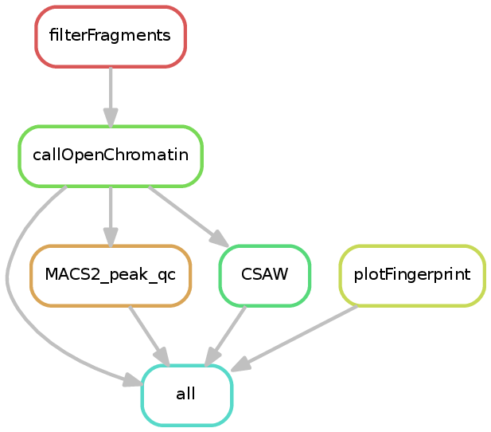

.. _ATACseq:

ATACseq
========

What it does
------------

The ATACseq pipeline takes one or more BAM files and attempts to find accessible regions. If multiple samples and a sample sheet are provided, then CSAW is additionally used to find differentially accessible regions. Prior to finding open/accessible regions, the BAM files are filtered to include only properly paired reads with appropriate fragment sizes (<150 bases by default). These filtered fragments are then used for the remainder of the pipeline.

.. note:: The **CSAW** step will be skipped if there is no ``sample_info`` tsv file (see :ref:`running_snakePipes`).

Input requirements
------------------

The DNA mapping pipeline generates output that is fully compatible with the ATACseq pipeline input requirements!
When running the ATACseq pipeline, please specify the output directory of DNAmapping pipeline as the working directory (``-d``).

* **filtered_bam** directory contains the input BAM files (either filtered or unfiltered, however you prefer).

* **sampleSheet.tsv** (OPTIONAL) is only needed to test for differential binding.

.. _diffOpenChrom:

Differential open chromatin analysis
~~~~~~~~~~~~~~~~~~~~~~~~~~~~~~~~~~~~~

Similar to differential binding analysis with the ChIPseq data. We can perform the differential open chromatin analysis, using the ``--sampleSheet`` option of the ATACseq workflow. This requires a sample sheet, which is identical to that required by the ChIPseq and RNA-seq workflows (see :doc:`ChIPseq` for details).

An example is below::

    name    condition
    sample1      eworo
    sample2      eworo
    SRR7013047      eworo
    SRR7013048      OreR
    SRR7013049      OreR
    SRR7013050      OreR

.. note:: This sample sheet has the same requirements as the sample sheet in the ChIPseq workflow, and also uses the same tool (CSAW) with a narrow default window size.

For comparison between two conditions, the name you assign to "condition" is not relevant, but rather the order is. The group mentioned first (in the above case "wild-type") would be used as a "control" and the group mentioned later would be used as "test".

If the user provides additional columns between 'name' and 'condition' in the sample sheet, the variables stored there will be used as blocking factors in the order they appear in the sample sheet. Condition will be the final column and it will be used for any statistical inference. 

The differential binding module utilizes the R package `CSAW <https://bioconductor.org/packages/release/bioc/html/csaw.html>`__ to detect significantly different peaks between two conditions.
The analysis is performed on a union of peaks from all samples mentioned in the sample sheet. 
This merged set of regions are provided as an output inside the **CSAW_MACS2_sampleSheet** folder as the file 'DiffBinding_allregions.bed'. 
All differentially bound regions are available in 'CSAW/DiffBinding_significant.bed' . 
Two thresholds are applied to produce ``Filtered.results.bed`` : FDR (default ``0.05`` ) as well as absolute log fold change (``1``). These can be specified either in the defaults.yaml dictionary or via commandline parameters '--FDR' and '--LFC'. Additionally, filtered results are split into up to 3 bed files, representing direction change (UP, DOWN, or MIXED).

.. note:: In order to include or exclude peaks from selected samples in the union of peaks used in the differential binding analysis, the user may provide an additional column named 'UseRegions' and set it to True or False, accordingly. This column must supersede the 'condition' column in the column order. 

Merged regions from filtered results with any direction change are further used to produce deepTools heatmaps, using depth-normalized coverage. For this purpose, the regions are rescaled to 1kb, and extended by 0.2kb on each side.

An html report summarizing the differential binding analysis is produced in the same folder.

Filtered results are also annotated with the distance to the closest gene using bedtools closest and written as '.txt' files to the AnnotatedResults_* folder.

.. _ATACconfig:

Configuration file
~~~~~~~~~~~~~~~~~~

There is a configuration file in ``snakePipes/workflows/ATACseq/defaults.yaml``::

    ## General/Snakemake parameters, only used/set by wrapper or in Snakemake cmdl, but not in Snakefile
    pipeline: ATACseq
    configFile:
    clusterConfigFile:
    local: false
    maxJobs: 5
    ## workingdir need to be required DNAmapping output dir, 'outdir' is set to workingdir internally
    workingdir:
    ## preconfigured target genomes (mm9,mm10,dm3,...) , see /path/to/snakemake_workflows/shared/organisms/
    ## Value can be also path to your own genome config file!
    genome:
    ## The maximum fragment size to retain. This should typically be the size of a nucleosome
    maxFragmentSize: 150
    minFragmentSize: 0
    verbose: false
    ## which peak caller to use
    peakCaller: 'MACS2'
    # sampleSheet_DB
    sampleSheet:
    # windowSize
    windowSize: 20
    fragmentCountThreshold: 1
    #### Flag to control the pipeline entry point
    bamExt: '.filtered.bam'
    fromBAM: 
    ## Bin size of output files in bigWig format
    bwBinSize: 25
    pairedEnd: True
    plotFormat: png
    ## Median/mean fragment length, only relevant for single-end data (default: 200)
    fragmentLength: 
    trim:
    fastqc:
    qval: 0.001
    ##dummy string to skip filtering annotation
    filter_annotation:
    ##parameters to filter DB regions on
    fdr: 0.05
    absBestLFC: 1

Useful parameters are ``maxFragmentSize``, ``minFragmentSize`` and ``windowSize``, also available from commandline.  

* **windowSize**: is the size of windows to test differential binding using CSAW. The default small window size is sufficient for most analysis, since an ATACseq peak is sharp.

* **fragmentCountThreshold**: refers to the minimum number of counts a chromosome must have to be included in the MACS2 analysis. It is introduced to avoid errors in the peak calling step and should only be changed if MACS2 fails.

* **Qval**: a value provided to MACS2 that affects the number and width of the resulting peaks.

Understanding the outputs
---------------------------

Assuming a sample sheet is used, the following will be **added** to the working directory::

    .
    ├── CSAW_MACS2_sampleSheet
    │   ├── CSAW.log
    │   ├── CSAW.session_info.txt
    │   ├── DiffBinding_allregions.bed
    │   ├── DiffBinding_analysis.Rdata
    │   ├── DiffBinding_modelfit.pdf
    │   ├── DiffBinding_scores.txt
    │   ├── DiffBinding_significant.bed
    │   ├── QCplots_first_sample.pdf
    │   ├── QCplots_last_sample.pdf
    │   └── TMM_normalizedCounts.pdf
    ├── deepTools_ATAC
    │   └── plotFingerprint
    │       ├── plotFingerprint.metrics.txt
    │       └── plotFingerprint.png
    ├── Genrich
    │   └── group1.narrowPeak
    ├── HMMRATAC
    │   ├── sample1.log
    │   ├── sample1.model
    │   ├── sample1_peaks.gappedPeak
    │   ├── sample1_summits.bed
    │   └── sample1_training.bed
    ├── MACS2
    │   ├── sample1.filtered.BAM_control_lambda.bdg
    │   ├── sample1.filtered.BAM_peaks.narrowPeak
    │   ├── sample1.filtered.BAM_peaks.xls
    │   ├── sample1.filtered.BAM_summits.bed
    │   ├── sample1.filtered.BAM_treat_pileup.bdg
    │   ├── sample1.short.metrics
    │   ├── sample2.filtered.BAM_control_lambda.bdg
    │   ├── sample2.filtered.BAM_peaks.narrowPeak
    │   ├── sample2.filtered.BAM_peaks.xls
    │   ├── sample2.filtered.BAM_summits.bed
    │   ├── sample2.filtered.BAM_treat_pileup.bdg
    │   └── sample2.short.metrics
    └── MACS2_QC
        ├── sample1.filtered.BAM_peaks.qc.txt
        └── sample2.filtered.BAM_peaks.qc.txt

Currently the ATACseq workflow performs detection of open chromatin regions via `MACS2 <https://github.com/taoliu/MACS>`__ (or `HMMRATAC <https://academic.oup.com/nar/article/47/16/e91/5519166>`__ or `Genrich <https://github.com/jsh58/Genrich>`__, if specified with ``--peakCaller``), and if a sample sheet is provided, the detection of differential open chromatin sites via `CSAW <https://bioconductor.org/packages/release/bioc/html/csaw.html>`__. There are additionally log files in most of the directories. The various outputs are documented in the CSAW and MACS2 documentation.
For more information on the contents of the **CSAW_MACS2_sampleSheet** folder, see section :ref:`diffOpenChrom` .

* **MACS2** / **HMMRATAC** / **Genrich**: Contains peaks found by the peak caller. The most useful files end in ``.narrowPeak`` or ``.gappedPeak`` and are appropriate for visualization in IGV.

* **MACS2_QC**: contains a number of QC metrics that we find useful, namely :
    * the number of peaks
    * fraction of reads in peaks (FRiP)
    * percentage of the genome covered by peaks.

* **deepTools_ATAC**: contains the output of `plotFingerPrint <https://deeptools.readthedocs.io/en/develop/content/tools/plotFingerprint.html>`__, which is a useful QC plot to assess signal enrichment between the ATACseq samples.

.. note:: The ``_sampleSheet`` suffix for the ``CSAW_MACS2_sampleSheet`` is drawn from the name of the sample sheet you use. So if you instead named the sample sheet ``mySampleSheet.txt`` then the folder would be named ``CSAW_mySampleSheet``. This facilitates using multiple sample sheets. Similarly, ``_MACS2`` portion will be different if you use HMMRATAC or Genrich for peak calling.

.. note:: If you provide a sampleSheet with name, condition and group columns, "multiple comparison mode" will be detected. The original sampleSheet will be split on the group column, and multiple pairwise comparisons will be run with CSAW, one per group.

.. note:: The output from Genrich will be peaks called per-group if you specify a sample sheet. This is because Genrich is capable of directly using replicates during peak calling.

Where to find final bam files and biwgwigs
------------------------------------------

Bam files with the extention filtered.bam are only filtered for PCR duplicates. The final bam files filtered additionally for fragment size and used as direct input to MACS2 are found in the short_bams folder with the exention ``.short.cleaned.bam``.
Bigwig files calculated from these bam files are found under deepTools_ATAC/bamCompare with the extention ``.filtered.bw``.

Command line options
--------------------

.. argparse::
    :func: parse_args
    :filename: ../snakePipes/workflows/ATACseq/ATACseq
    :prog: ATACseq
    :nodefault:
