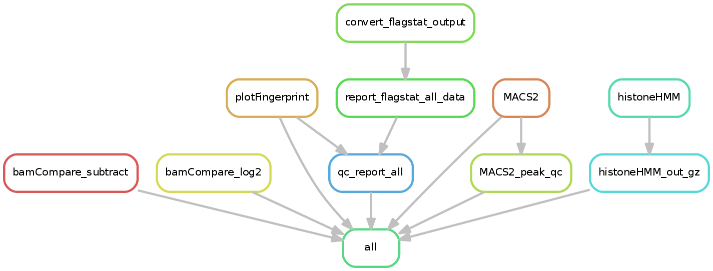

.. _ChIPseq:

ChIPseq
========

What it does
------------

The `ChIPseq <https://epigenie.com/guide-getting-started-with-ChIPseq/>`__ pipeline takes one or more BAM files and attempts to find peaks. If multiple samples and a sample sheet are provided, then CSAW is additionally used to call differential peaks. Both sharp and broad peak calling are supported.

In addition to peaks, bigWig tracks are also generated.

Input requirements
------------------

The DNA mapping pipeline generates output that is fully compatible with the ChIPseq pipeline input requirements!
When running the ChIPseq pipeline, please specify the output directory of DNAmapping pipeline as the working directory (``-w``).

If you need to provides file **NOT** generated by the DNAmapping pipeline, then you must provide a directory with the following structure::

    .
    ├── deepTools_qc
    │   └── bamPEFragmentSize
    │       ├── fragmentSize.metric.tsv
    │       └── fragmentSizes.png
    ├── filtered_bam
    │   ├── sample1.filtered.bam
    │   ├── sample1.filtered.bam.bai
    │   ├── sample2.filtered.bam
    │   └── sample2.filtered.bam.bai
    ├── Sambamba
    │   ├── flagstat_report_all.tsv
    │   ├── sample1.markdup.txt
    │   └── sample2.markdup.txt
    └── sampleSheet.yaml

* **deepTools_qc** contains the output of `bamPEFragmentSize <https://deeptools.readthedocs.io/en/develop/content/tools/bamPEFragmentSize.html>`__ from deepTools, run on all the BAM files.

* **Sambamba** directory contains the output of ``flagstat`` command from `sambamba <http://lomereiter.github.io/sambamba/>`__ (the ``.markdup.txt`` files) and a single file summarizing that with columns ``sample`` (sample name, such as sampl1), ``total`` (total reads), ``dup`` (number of duplicate reads), and ``mapped`` (number of mapped reads).

* **filtered_bam** directory contains the input BAM files (either filtered or unfiltered, however you prefer).

* **sampleSheet.tsv** (OPTIONAL) is only needed to test for differential binding.

Sample configuration
~~~~~~~~~~~~~~~~~~~~

The ChIPseq sample configuration yaml file describes what type of peak calling to perform on each sample and which sample to use as the `input control <https://www.biostars.org/p/15817/>`__ ::

    chip_dict:
      SRR6761497:
        control: SRR6761502
        broad: True
      SRR6761498:
        control: SRR6761502
        broad: True
      SRR6761495:
        control: SRR6761502
        broad: False
      SRR6761499:
        control: SRR6761502
        broad: False

As you can see above, the same control can be used for multiple samples.

.. note:: Set the flag broad to `True` for broad marks, such as H3K27me and H3K9me3

.. _spikein:

Spikein Normalization
~~~~~~~~~~~~~~~~~~~~~~~~~~~~~

If chromatin from an external organism was spikein in, it is possible to obtain spikein-derived scaling factors for the ChIP (and input) samples with the flag ``--useSpikeInForNorm``. This requires providing a hybrid bam file, with reads aligned to a hybrid genome of host and spikein chromosomes. Spikein chromosome extention can be specified with `--spikeinExt`. Scale factors can be obtained either from whole spikein genome in the ChIP samples, from windows centered on TSS in the spikein genome in the ChIP samples, or from whole spikein genome in the input samples . The default scale factors from whole spikein genome in the ChIP samples can be changed to something else with ``--getSizeFactorsFrom``.

DESeq2-style scaling factors produced with deepTools multiBamSummary will then be used to create bam coverage tracks and passed to CSAW as size Factors if sample sheet is provided.

A hybrid genome can be obtained with createIndices workflow and can be passed to the DNAmapping workflow without any particular arguments.

.. _diffBinding:

Differential Binding analysis
~~~~~~~~~~~~~~~~~~~~~~~~~~~~~

If you wish to perform differential binding analysis between two group of samples, for example wild-type vs Knock-outs, via snakePipes. You would require a sample-sheet and the ``--sampleSheet`` option. Sample sheet may contain only a subset of samples used in the previous steps e.g. for peak calling.
In addition, input samples are filtered out prior to the analysis using the sample configuration yaml (see above).

The sample sheet is a tab-separated file with two columns, named name and condition. An example is below::

    name    condition
    sample1 wild-type
    sample2 wild-type
    SRR7013047      wild-type
    SRR7013048      mutant
    SRR7013049      mutant
    SRR7013050      mutant

For comparison between two conditions, the name you assign to "condition" is not relevant, but rather the order is. The group mentioned first (in the above case "wild-type") would be used as a "control" and the group mentioned later would be used as "test".

The differential binding module utilizes the R package `CSAW <https://bioconductor.org/packages/release/bioc/html/csaw.html>`__ to detect significantly different peaks between two conditions. The analysis is performed on a "union" of peaks from all samples mentioned in the sample sheet. This merged set of regions are provided as an output inside the **CSAW** folder as the file 'DiffBinding_allregions.bed'. All differentially bound regions are available in 'CSAW/DiffBinding_significant.bed'. Two thresholds are applied to produce ``Filtered.results.bed`` : FDR (default ``0.05`` ) as well as absolute log fold change (``1``). These can be specified either in the defaults.yaml dictionary or via commandline parameters '--FDR' and '--LFC'. Additionally, filtered results are split into up to 3 bed files, representing direction change (UP, DOWN, or MIXED).

If the user provides additional columns between 'name' and 'condition' in the sample sheet, the variables stored there will be used as blocking factors in the order they appear in the sample sheet. Condition will be the final column and it will be used for any statistical inference. 

.. note:: In order to include or exclude peaks from selected samples in the union of peaks used in the differential binding analysis, the user may provide an additional column named 'UseRegions' and set it to True or False, accordingly. This column must supersede the 'condition' column in the column order. 

Merged regions from filtered results with any direction change are further used to produce deepTools heatmaps, using log2 ratio of chip signal to input or depth-normalized coverage. For this purpose, the regions are rescaled to 1kb, and extended by 0.2kb on each side.

An html report summarizing the differential binding analysis is produced in the same folder.

Filtered results are also annotated with the distance to the closest gene using bedtools closest and written as '.txt' files to the AnnotatedResults_* folder.

.. _ChIPconfig:

Configuration file
~~~~~~~~~~~~~~~~~~

There is a configuration file in ``snakePipes/workflows/ChIPseq/defaults.yaml``::

    pipeline: ChIPseq
    configFile:
    clusterConfigFile:
    local: false
    maxJobs: 5
    ## workingdir need to be required DNAmapping output dir, 'outdir' is set to workingdir internally
    workingdir:
    ## preconfigured target genomes (mm9,mm10,dm3,...) , see /path/to/snakemake_workflows/shared/organisms/
    ## Value can be also path to your own genome config file!
    genome:
    ## Which peak caller should be used?
    peakCaller: 'MACS2'
    ## paired end data?
    pairedEnd: true
    ## Bin size of output files in bigWig format
    bwBinSize: 25
    ## Median/mean fragment length, only relevant for single-end data (default: 200)
    fragmentLength: 200
    verbose: false
    # sampleInfo_DB
    sample_info:
    # windowSize
    windowSize: 150
    plot_format: png
    ##dummy string to skip filtering annotation
    filter_annotation:
    ##parameters to filter DB regions on
    fdr: 0.05
    absBestLFC: 1

The only parameters that are useful to change are ``bwBinSize``, ``fragmentLength``, and ``windowSize``. Note however that those can be more conveniently changed on the command line.

Understanding the outputs
---------------------------

The ChIPseq pipeline will generate additional output as follows::

    .
    ├── deepTools_ChIP
    │   ├── bamCompare
    │   │   ├── sample1.filtered.log2ratio.over_SRR6761502.bw
    │   │   ├── sample1.filtered.subtract.SRR6761502.bw
    │   │   ├── sample2.filtered.log2ratio.over_SRR6761502.bw
    │   │   └── sample2.filtered.subtract.SRR6761502.bw
    │   └── plotFingerprint
    │       ├── plotFingerprint.metrics.txt
    │       └── plotFingerprint.png
    ├── histoneHMM
    │   ├── sample2.filtered.histoneHMM-em-posterior.txt.gz
    │   ├── sample2.filtered.histoneHMM-regions.gff.gz
    │   ├── sample2.filtered.histoneHMM-regions.gff.gz.tbi
    │   ├── sample2.filtered.histoneHMM.txt.gz
    │   ├── sample2.filtered.histoneHMM-zinba-emfit.pdf
    │   ├── sample2.filtered.histoneHMM-zinba-params-em.RData
    │   └── sample2.filtered.histoneHMM-zinba-params-em.txt
    ├── Genrich
    │   └── sample2.narrowPeak
    └── MACS2
        ├── sample1.filtered.BAM_peaks.narrowPeak
        ├── sample1.filtered.BAM_peaks.qc.txt
        ├── sample1.filtered.BAM_peaks.xls
        ├── sample1.filtered.BAMPE_peaks.narrowPeak
        ├── sample1.filtered.BAMPE_peaks.xls
        ├── sample1.filtered.BAMPE_summits.bed
        ├── sample1.filtered.BAM_summits.bed
        ├── sample2.filtered.BAM_peaks.broadPeak
        ├── sample2.filtered.BAM_peaks.gappedPeak
        ├── sample2.filtered.BAM_peaks.qc.txt
        ├── sample2.filtered.BAM_peaks.xls
        ├── sample2.filtered.BAMPE_peaks.broadPeak
        ├── sample2.filtered.BAMPE_peaks.gappedPeak
        └── sample2.filtered.BAMPE_peaks.xls
    

Following up on the DNAmapping module results (see :doc:`DNAmapping`), the workflow produces the following output directories :

* **deepTools_ChIP**: Contains output from two of the deepTools modules. The `bamCompare <https://deeptools.readthedocs.io/en/develop/content/tools/bamCompare.html>`__ output contains the input-normalized coverage files for the samples, which is very useful for downstream analysis, such as visualization in IGV and plotting the heatmaps. The `plotFingerPrint <https://deeptools.readthedocs.io/en/develop/content/tools/plotFingerprint.html>`__ output is a useful QC plot to assess signal enrichment in the ChIP samples.

* **Genrich**: This folder contains the output of `Genrich <https://github.com/jsh58/Genrich>`__. This will only exist IF you specified ``--peakCaller Genrich`` and you have samples with non-broad peaks. The output is in narrowPeak format, like that from MACS2.

* **MACS2**: This folder contains the output of `MACS2 <https://github.com/taoliu/MACS>`__ on the ChIP samples, MACS2 would perform either a **narrow** or **broad** peak calling on the samples, as indicated by the ChIP sample configuration file (see :ref:`ChIPconfig`). The outputs files would contain the respective tags (**narrowPeak** or **broadPeak**). This folder will only exist if you have non-broad marks and use MACS2 for peak calling

* **histoneHMM**: This folder contains the output of `histoneHMM <https://github.com/matthiasheinig/histoneHMM>`__. This folder will only exist if you have broad marks.

* **CSAW_sampleSheet**: This folder is created optionally, if you provide a sample sheet for differential binding analysis. (see :ref:`diffBinding`) CSAW will be run using peaks called by the chosen peak caller, and the output folder will be named accordingly.
* **AnnotatedResults_sampleSheet**: This folder is created optionally, if you provide a sample sheet for differential binding analysis. (see :ref:`diffBinding`). Differentially bound regions annotated with distance to nearest gene are stored here.

.. note:: Although in case of broad marks, we also perform the MACS2 `broadpeak` analysis (output available as ``MACS2/<sample>.filtered.BAM_peaks.broadPeak``), we would recommend using the histoneHMM outputs in these cases, since histoneHMM produces better results than MACS2 for broad peaks.

.. note:: For narrow marks, the user may choose the peak caller from MACS2 (default), Genrich or `SEACR <https://github.com/FredHutch/SEACR>`__. By deafult, SEACR is run in the stringent mode, applying normalization to counts over bed files. If invoked together with ``--useSpikeInForNorm``, SEACR will be run in stringent mode, using spikein-normalized counts. FDR can be set by the user (default 0.05).

.. note:: The ``_sampleSheet`` suffix for the ``CSAW_sampleSheet`` is drawn from the name of the sample sheet you use. So if you instead named the sample sheet ``mySampleSheet.txt`` then the folder would be named ``CSAW_mySampleSheet``. This facilitates using multiple sample sheets.

.. note:: If you provide a sampleSheet with name, condition and group columns, "multiple comparison mode" will be detected. The original sampleSheet will be split on the group column, and multiple pairwise comparisons will be run with CSAW, one per group.

.. note:: If provided with sampleSheet, Genrich will be used to jointly call peaks within a condition group. It will utilize the input controls if they exist.

Command line options
--------------------

.. argparse::
    :func: parse_args
    :filename: ../snakePipes/workflows/ChIPseq/ChIPseq.py
    :prog: ChIPseq
    :nodefault:
