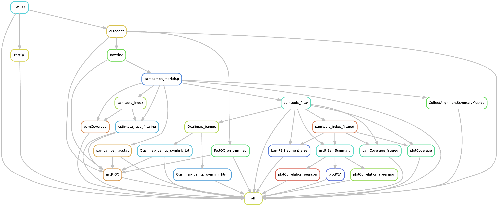
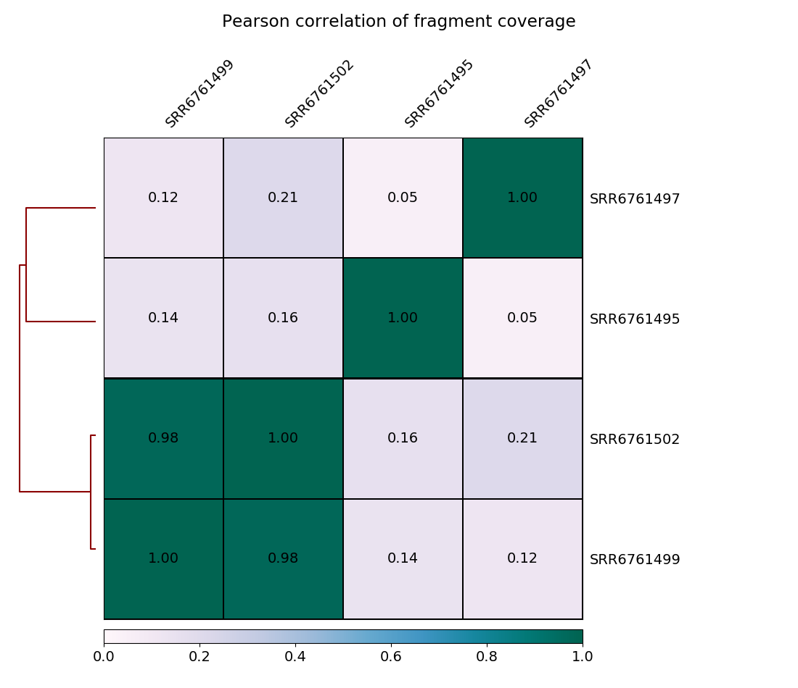

.. _DNAmapping:

DNAmapping
===========

What it does
------------

This is the primary DNAmapping pipeline. It can be used both alone or upstream of the ATACseq and ChIPseq pipelines. This has a wide array of options, including trimming and various QC steps (e.g., marking duplicates and plotting coverage and PCAs). In addition, basic coverage tracks are created to facilitate viewing the data in IGV.

Input requirements
------------------

The only requirement is a directory of gzipped fastq files. Files could be single or paired end, and the read extensions could be modified using the keys in the ``defaults.yaml`` file below.

Configuration file
~~~~~~~~~~~~~~~~~~

There is a configuration file in ``snakePipes/workflows/DNAmapping/defaults.yaml``::

    ## General/Snakemake parameters, only used/set by wrapper or in Snakemake cmdl, but not in Snakefile
    pipeline: dnamapping
    outdir:
    configFile:
    clusterConfigFile:
    local: False
    maxJobs: 5
    ## directory with fastq files
    indir:
    ## preconfigured target genomes (mm9,mm10,dm3,...) , see /path/to/snakemake_workflows/shared/organisms/
    ## Value can be also path to your own genome config file!
    genome:
    ## FASTQ file extension (default: ".fastq.gz")
    ext: '.fastq.gz'
    ## paired-end read name extension (default: ['_R1', "_R2"])
    reads: [_R1, _R2]
    ## mapping mode
    mode: mapping
    aligner: Bowtie2
    ## Number of reads to downsample from each FASTQ file
    downsample:
    ## Options for trimming
    trim: False
    trimmer: cutadapt
    trimmerOptions:
    ## Bin size of output files in bigWig format
    bwBinSize: 25
    ## Run FASTQC read quality control
    fastqc: false
    ## Run computeGCBias quality control
    GCBias: false
    ## Retain only de-duplicated reads/read pairs
    dedup: false
    ## Retain only reads with at least the given mapping quality
    mapq: 0
    ## Retain only reads mapping in proper pairs
    properPairs: false
    ## Mate orientation in paired-end experiments for Bowtie2 mapping
    ## (default "--fr" is appropriate for Illumina sequencing)
    mateOrientation: --fr
    ## other Bowtie2 stuff
    insertSizeMax: 1000
    alignerOpts:
    plotFormat: png
    UMIBarcode: False
    bcPattern: NNNNCCCCCCCC #default: 4 base umi barcode, 8 base cell barcode (eg. RELACS barcode)
    UMIDedup: False
    UMIDedupSep: "_"
    UMIDedupOpts:
    ## Median/mean fragment length, only relevant for single-end data (default: 200)
    fragmentLength: 200
    qualimap: false
    verbose: false

Many of these options can be more conveniently set on the command-line (e.g., ``--qualimap`` sets ``qualimap: true``). However, you may need to change the ``reads:`` setting if your paired-end files are not denoted by ``sample_R1.fastq.gz`` and ``sample_R2.fastq.gz``, but rather ``sample_1.fastq.gz`` and ``sample_2.fastq.gz``.

Understanding the outputs
--------------------------

The DNA mapping pipeline will generate output of the following structure::

    .
    ├── bamCoverage
    ├── Bowtie2
    ├── deepTools_qc
    │   ├── bamPEFragmentSize
    │   ├── estimateReadFiltering
    │   ├── multiBamSummary
    │   ├── plotCorrelation
    │   ├── plotCoverage
    │   └── plotPCA
    ├── FASTQ
    ├── FastQC
    ├── filtered_bam
    ├── multiQC
    │   └── multiqc_data
    └── Sambamba

In addition to the FASTQ module results (see :ref:`running_snakePipes`), the workflow produces the following outputs:

 * **Bowtie2** : Contains the BAM files after mapping with `Bowtie2 <http://bowtie-bio.sourceforge.net/bowtie2/index.shtml>`__ and indexed by `Samtools <http://www.htslib.org/>`__.

 * **filtered_bam** : Contains the BAM files filtered by the provided criteria, such as mapping quality (``--mapq``) or PCR duplicates (``--dedup``). This file is used for most downstream analysis in the DNAmapping and ChIPseq/ATACseq pipeline.

 * **bamCoverage** : Contains the coverage files (`bigWig format <https://genome.ucsc.edu/goldenpath/help/bigWig.html>`__) produced from the BAM files by `deepTools bamCoverage <https://deeptools.readthedocs.io/en/develop/content/tools/bamCoverage.html>`__ . The files are either raw, or 1x normalized (by sequencing depth). They are useful for plotting and inspecting the data in IGV.

 * **deepTools_qc** : Contains various QC files and plots produced by deepTools on the filtered BAM files. These are very useful for evaluation of data quality. The folders are named after the tools. Please look at the `deepTools documentation <https://deeptools.readthedocs.io/en/develop/content/list_of_tools.html>`__ on how to interpret the outputs from each tool.

 * **Sambamba** : Contains the alignment metrices evaluated on the BAM files by `Sambamba <http://lomereiter.github.io/sambamba/>`__.

A number of other directories may optionally be present if you specified read trimming, using Qualimap, or a variety of other options. These are typically self-explanatory.

A fair number of useful QC plots are or can be generated by the pipeline. These include correlation and PCA plots as well as the output from MultiQC.

Command line options
--------------------

.. argparse::
   :func: parse_args
   :filename: ../snakePipes/workflows/DNAmapping/DNAmapping.py
   :prog: DNAmapping
   :nodefault:
