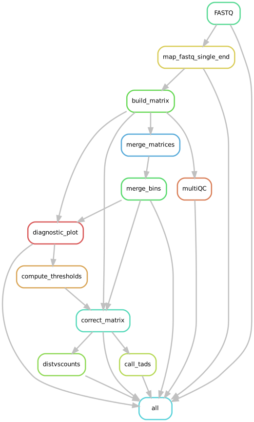
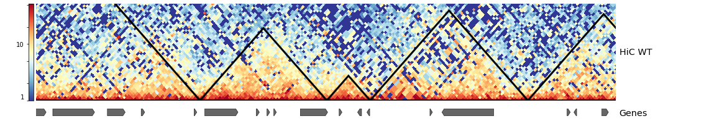

.. _HiC:

HiC
===

What it does
------------

The snakePipes HiC workflow allows users to process their HiC data from raw fastq files to
corrected HiC matrices and TADs. The workflow utilized mapping by bwa or bwa-mem2 , followed by analysis
using `HiCExplorer <https://www.nature.com/articles/s41467-017-02525-w>`__. The workflow follows the `example workflow described in the documentation of HiCExplorer <https://hicexplorer.readthedocs.io/en/latest/content/mES-HiC_analysis.html>`__, which explains each step in detail and would be useful for new users to have a look at. The output matrices
are produced in the `.hdf5 <https://en.wikipedia.org/wiki/Hierarchical_Data_Format>`__ format.

Input requirements and outputs
------------------------------

This pipeline requires paired-end reads fastq files as input in order to build a contact matrix and to call TADs.
Prior to building the matrix, the pipeline maps reads against a user-specified reference genome.
The output of mapping step is then used for building the contact matrix.

Workflow configuration file
---------------------------

Default parameters from the provided config file can be altered by user. Below is
the config file description for the HiC workflow :

.. parsed-literal::

      ################################################################################
      # This file is the default configuration of the HiC workflow!
      #
      # In order to adjust some parameters, please either use the wrapper script
      # (eg. /path/to/snakemake_workflows/workflows/HiC/HiC)
      # or save a copy of this file, modify necessary parameters and then provide
      # this file to the wrapper or snakmake via '--configFile' option
      # (see below how to call the snakefile directly)
      #
      # Own parameters will be loaded during snakefile executiuon as well and hence
      # can be used in new/extended snakemake rules!
      ################################################################################
      ## General/Snakemake parameters, only used/set by wrapper or in Snakemake cmdl, but not in Snakefile
      pipeline: hic
      outdir:
      configFile:
      clusterConfigFile:
      #set to true if running locally
      local: False
      #number of threads
      maxJobs: 5
      ## directory with fastq files
      indir:
      ## preconfigured target genomes (mm9,mm10,dm3,...) , see /path/to/snakemake_workflows/shared/organisms/
      ## Value can be also path to your own genome config file!
      genome:
      ## FASTQ file extension (default: ".fastq.gz")
      ext: '.fastq.gz'
      ## paired-end read name extension (default: ['_R1', "_R2"])
      reads: ['_R1', '_R2']
      aligner: BWA
      ## Number of reads to downsample from each FASTQ file
      downsample:
      ## Options for trimming and fastqc
      trim: False
      trimmer: cutadapt
      trimmerOptions:
      fastqc: false
      verbose: False
      ## is the Matrix RF resolution?
      RFResolution: false
      # which restriction enzyme was used
      enzyme: HindIII
      # bin size in base pairs, if RF resolution is not required
      binSize: 10000
      # build matrix only for a given region chr:start-end
      restrictRegion:
      # Create files after merging a given number bins to be merged (default 0 = bins are not merged)
      nBinsToMerge: 0
      # shall we merge the samples?
      mergeSamples: false
      # parameters for hicFindTADs
      findTADParams: '--thresholdComparisons 0.01'
      # Should hicPlotDistVsCounts be run?
      distVsCount: false
      #Parameters to run hicPlotDistVsCounts
      distVsCountParams:
      #Terminate the pipeline before calling TADs
      noTAD: false
      #Terminate the pipeline before correting the matrices with a certain cutoff value
      noCorrect: false
      # Method to balance a matrix
      correctionMethod: KR
      #Chromosomes of interest to build matrix on them
      chromosomes:
      # a .tsv file contains names and replicates of samples. It is needed if mergeSamples
      sampleSheet:
      #print tools versions
      toolsVersion: True
      #umi_tools
      UMIBarcode: False
      bcPattern: NNNNCCCCCCCCC #default: 4 base umi barcode, 9 base cell barcode (eg. RELACS barcode)
      UMIDedup: False
      UMIDedupSep: "_"
      UMIDedupOpts: --paired
      ################################################################################
      # Call snakemake directly, i.e. without using the wrapper script:
      #
      # Please save a copy of this config yaml file and provide an adjusted config
      # via '--configFile' parameter!
      # example call:
      #
      # snakemake --snakefile /path/to/snakemake_workflows/workflows/HiC/Snakefile
      #           --configFile /path/to/snakemake_workflows/workflows/HiC/defaults.yaml
      #           --directory /path/to/outputdir
      #           --cores 32
      ################################################################################

Structure of output directory
-----------------------------

In addition to the FASTQ module results (see :ref:`running_snakePipes`), the workflow produces the following outputs::

    .
    |--bwa
    |--FASTQ
    |--HiC_matrices
    |   |--logs
    |   |--QCplots
    |--HiC_matrices_corrected
    |   |--logs
    |--TADs
        |--logs

* **bwa** folder contains the mapping results in BAM format. The files were obtained after running `bwa <https://github.com/lh3/bwa>`__ on each of the paired-end reads individually.

* **HiC_matrices** folder accommodates the contact matrices generated by `hicBuildMatrix <https://hicexplorer.readthedocs.io/en/latest/content/tools/hicBuildMatrix.html>`__. In case of merging samples or merging bins the initial matrix is saved in this folder along with the merged ones.

    * **QCplot** includes the QC measurements for each sample along with a diagnostic plot which illustrates a distribution of counts per bin.  This information can be used to set a cutoff to prune (correct) the contact matrix.

.. note:: The cutoff value is computed by the pipeline and by default will be applied to build a corrected matrix. Generated matrices by the pipeline can further be used for downstream analysis such as detecting A/B compartments and they can also be visualized using `hicPlotMatrix <https://hicexplorer.readthedocs.io/en/latest/content/tools/hicPlotMatrix.html#hicplotmatrix>`__.

* **HiC_matrices_corrected** folder is in fact containing the corrected matrix which has been generated via `hicCorrectMatrix <https://hicexplorer.readthedocs.io/en/latest/content/tools/hicCorrectMatrix.html>`__ after pruning as has been mentioned above.

* **TADs** folder includes the output of calling TADs using `hicFindTADs <https://hicexplorer.readthedocs.io/en/latest/content/tools/hicFindTADs.html>`__. The output contains TAD boundaries,  TAD domains and TAD scores. These along with the matrices can be visualized together as several tracks using `pyGenomeTracks <https://github.com/deeptools/pyGenomeTracks>`__ or can be interactively browsed via `hicBrowser <https://github.com/deeptools/HiCBrowser>`__. Check figure below as an example.

Command line options
--------------------

.. argparse::
    :func: parse_args
    :filename: ../snakePipes/workflows/HiC/HiC.py
    :prog: HiC
    :nodefault:
