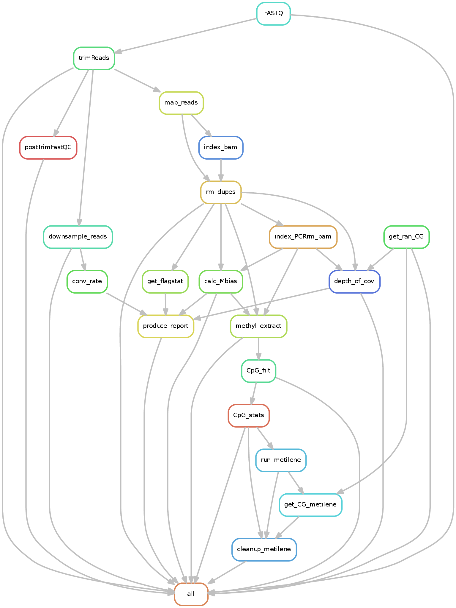
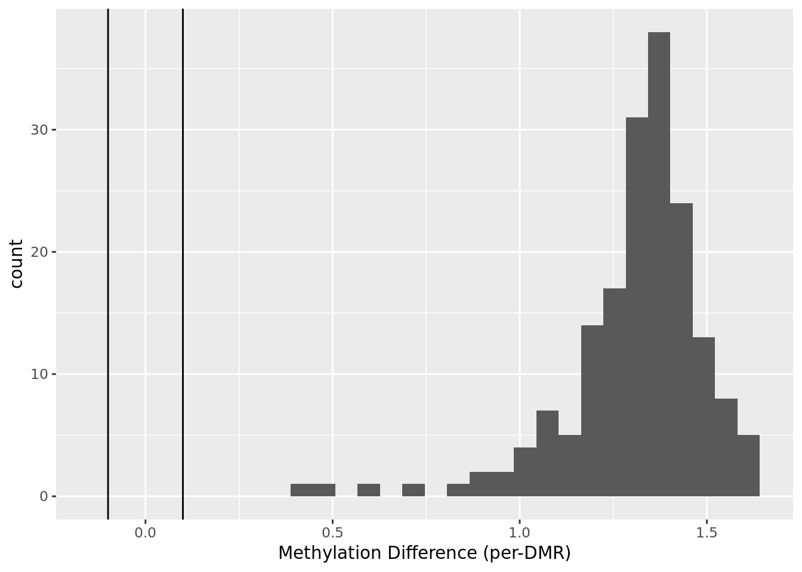
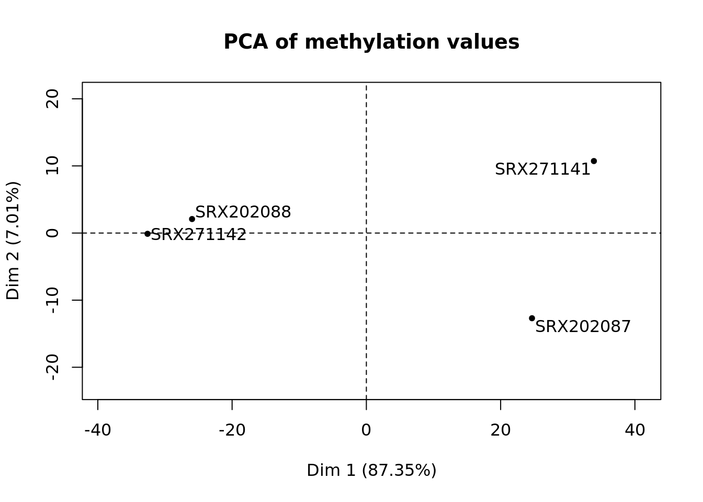
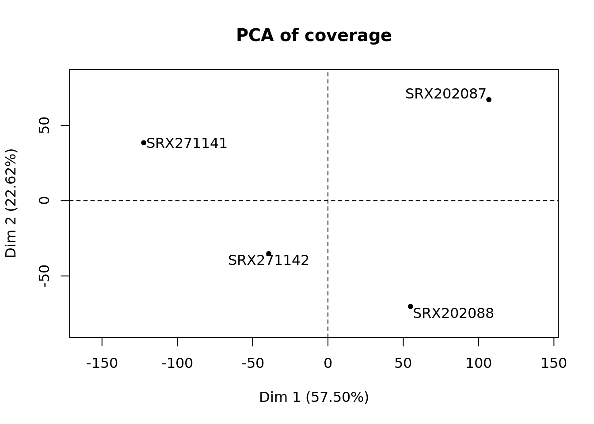

.. _WGBS:

WGBS
====

What it does
------------

Optionally trimmed reads are mapped to the reference genome using a bisulfite-specific aligner (`bwa-meth <https://github.com/brentp/bwa-meth>`__).
Quality metrics are collected and synthesized in a QC report, including bisulfite conversion rate, mapping rate, coverage metrics, and methylation bias.

There are two flags that allow skipping certain QC metric calculation, i.e. ``--skipDOC`` and ``--GCbias``. These deactivate or activate, respectively, the depth of coverage (DOC) calculations or GC bias calculation done by deepTools. If you run the workflow with ``--fromBAM``, you can also choose to skip the re-calculation of most QC metrics with ``--skipBamQC``.

Methylation ratios are extracted (via `MethylDackel <https://github.com/dpryan79/MethylDackel>`__) for CpG positions in the reference genome with a minimum coverage specified by ``--minCoverage``  and low SNP allelic frequency (<0.25 illegitimate bases).
If a sample sheet is provided, `Metilene <https://www.bioinf.uni-leipzig.de/Software/metilene/>`__ , `DMRseq <https://bioconductor.org/packages/release/bioc/html/dmrseq.html>`__ and/or `DSS <https://bioconductor.org/packages/release/bioc/html/DSS.html>`__ (as specified by ``--DMRprograms``) will be used to find differentially methylated regions (DMRs). Filtering criterion can be changed both for the CpGs used to find DMRs as well as what are considered as significant DMRs.

Input requirements
------------------

This pipeline requires fastq files and a genome alias, for which ``bwa-meth`` index has been built.
Optional inputs include a sample sheet with grouping information to use in differential methylation analysis and a blacklist bed file with genomic positions corresponding to known snps to mask single CpG methylation values.

It is possible to use pipeline-compatible bam files as input. For that, the user has to use the ``--fromBAM`` flag and provide the bam file extension if not matched by the default.

Workflow configuration file
---------------------------

.. parsed-literal::

	## General/Snakemake parameters, only used/set by wrapper or in Snakemake cmdl, but not in Snakefile
	outdir:
	configFile:
	clusterConfigFile:
	local: False
	maxJobs: 12
	## directory with fastq or bam files
	indir:
	## Genome information
	genome:
	###SNP black list (bed file)
	blacklist:
	###sample Sheet
	sampleSheet:
	###inclusion bounds for methylation extraction
	noAutoMethylationBias: False
	## FASTQ file extension (default: ".fastq.gz")
	ext: '.fastq.gz'
	## paired-end read name extension (default: ['_R1', "_R2"])
	reads: [_R1, _R2]
	## Number of reads to downsample from each FASTQ file
	downsample:
	## Options for trimming
	trim: False
	trimmer: 'fastp'
	trimmerOptions: '-q 5 -l 30 -M 5'
	## Bin size of output files in bigWig format
	bwBinSize: 25
	## Run FASTQC read quality control
	fastqc: false
	verbose: False
	plotFormat: 'png'
	#### Flag to control the pipeline entry point
	fromBAM: False
	bamExt: '.bam'
	pairedEnd: True
	###Flags to control skipping of certain QC calculations
	skipDOC: False
	GCbias: False
	###Thresholds for filtering of statistical comparisons (DMRs and DMLs)
	DMRprograms: 'metilene,dmrseq'
	maxDist: 300
	minCpGs: 10
	minCoverage: 5
	FDR: 0.1
	minMethDiff: 0.1
	###MethylDackel options
	MethylDackelOptions: '--mergeContext --maxVariantFrac 0.25 --minDepth 4'
	##umi_tools
	UMIBarcode: False
	bcPattern: NNNNCCCCCCCCC #default: 4 base umi barcode, 9 base cell barcode (eg. RELACS barcode)
	UMIDedup: False
	UMIDedupSep: "_"
	UMIDedupOpts: --paired
	aligner: bwameth

Understanding the outputs
---------------------------

The WGBS pipeline invoked fastq files and a sample sheet and the ``--trim`` and ``--fastqc`` options  will generate the following output:

::

    output_dir
    ├── bwameth
    ├── cluster_logs
    ├── dmrseq_sampleSheet_minCoverage5
    ├── FASTQ
    ├── FastQC_trimmed
    ├── FASTQ_fastp
    ├── MethylDackel
    ├── metilene_sampleSheet_minCoverage5
    ├── multiQC
    ├── originalFASTQ
    └── QC_metrics

The workflow produces the following outputs:

- **FASTQ_downsampled**: contains read files downsampled to 5mln reads. These are used to calculate conversion rate which would otherwise take a very long time.

- **bwameth**: contains bam files obtained through read alignment with bwa-meth and the PCR duplicate removal with sambamba, as well as matching bam index files.

- **dmrseq_sampleSheet_minCoverage<X>**: DMRs (DMRs.txt) and a report (Stats_report.html) from DMRseq as well as a saved R session (Session.RData) using the requested minimum coverage. If you rerun the pipeline with a different minimum coverage specified then a new directory will be created.

- **DSS_sampleSheet_minCoverage<X>**: As with DMRseq above.

- **FastQC_trimmed**: FastQC output on the trimmed reads.

- **FASTQ_fastp**: The trimmed reads and QC metrics from FastP.

- **MethylDackel**: BigWig coverage and methylation files as well as the bedGraph files produced by MethylDackel. 

- **metilene_sampleSheet_minCoverage<X>**: contains output files from metilene in DMRs.txt. DMRs.annotated.txt is an annotated version of that, wherein DMRs are annotated with the nearest gene and the distance to it. There is additionally a QC report (Stats_report.html) that summarizes various properties of the DMRs.

- **QC_metrics**: contains output files from conversion rate, flagstat, depth of coverage, GCbias and methylation bias calculations. The QC report in pdf format collecting those metrics in tabular form is also found in this folder.

Example output plots
--------------------

Using data from Habibi et al., Cell Stem Cell 2013 corresponding to mouse chr6:4000000-6000000, following plots could be obtained:

Command line options
--------------------

.. argparse::
    :func: parse_args
    :filename: ../snakePipes/workflows/WGBS/WGBS.py
    :prog: WGBS
    :nodefault:
