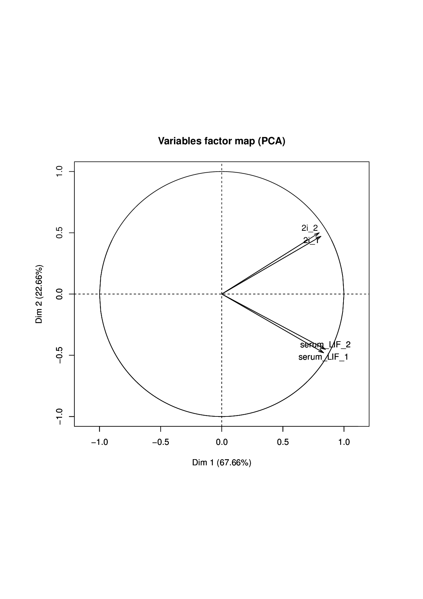
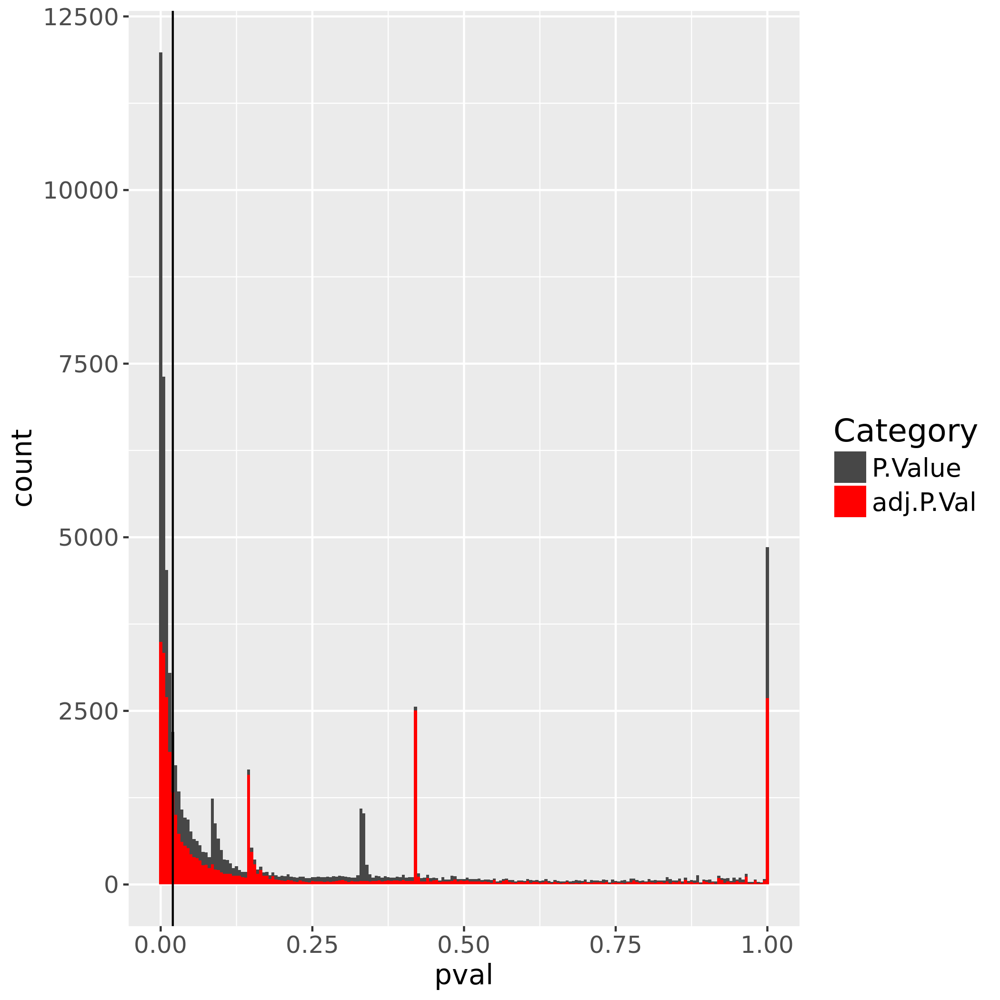
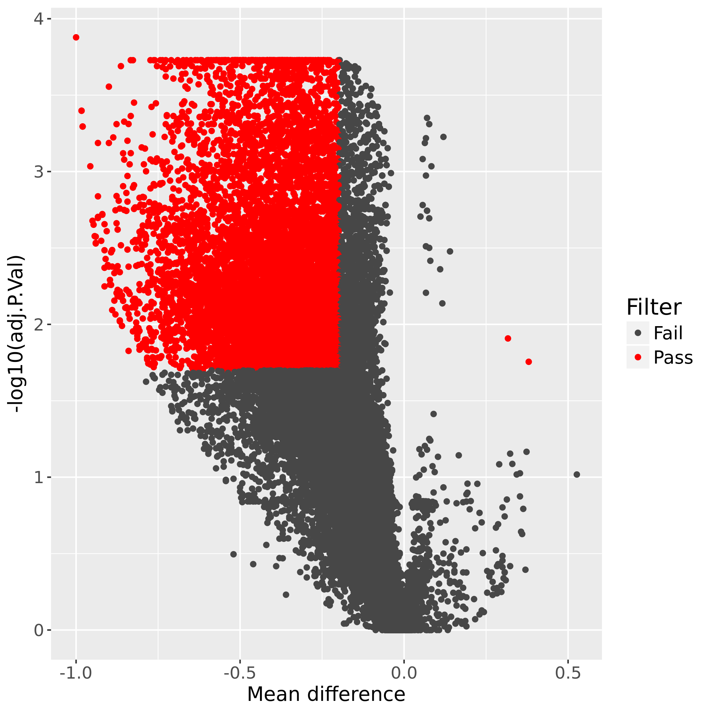

.. _WGBS:

WGBS
====

What it does
------------

Optionally trimmed reads are mapped to reference genome using a bisulfite-specific aligner (`bwa-meth <https://github.com/brentp/bwa-meth>`__).
Quality metrics are collected and synthesized in a QC report, including bisulfite conversion rate, mapping rate, percentage CpGs covered a least 10x, methylation bias.

There are two flags that allow skipping certain QC metric calculation, i.e. ``skipDOC`` and ``skipGCbias``. These deactivate the GATK-dependent calculation of depth of coverage and the deepTools-dependent calculation of GC bias,respectively, e.g. in case these metrics are known from another source.

Methylation ratios are extracted (via `MethylDackel <https://github.com/dpryan79/MethylDackel>`__) for CpG positions in the reference genome with a minimum coverage (10x) and low snp allelic frequency (<0.25 illegitimate bases).
If sample sheet is provided, logit-transformed beta values for CpG positions are tested for differential methylation using `limma <https://bioconductor.org/packages/release/bioc/html/limma.html>`__.
Metilene is called to detect de novo DMRs using parameters specified in the defaults dictionary. In addition to the nonparametric statistics output by metilene, limma-derived statistics are recalculated for DMRs, which are further annotated with nearest gene information.
If bed file(s) with genomic intervals of interest are provided, methylation ratios are aggregated over those and limma is used on logit-transformed methylation ratios to test for differential methylation.

Default filtering criteria for all statistical approaches are specified in the defaults.yaml as minimum absolute difference in methylation 0.2 (minAbsDiff) as well as FDR threshold (FDR) of 0.02. These values have been selected for a dataset with few events of differential methylation. The user is highly encouraged to rigorously inspect the resulting volcano plots and to adjust these filtering thresholds as appropriate for their dataset by providing an updated yaml file to the pipeline.

.. image:: ../images/WGBS_pipeline.png

Input requirements
------------------

This pipeline requires paired-end reads fastq files and a genome alias, for which ``bwa-meth`` index has been built.
Optional inputs include bed files with genomic intervals of interest, used to aggregate single CpG values over; a sample sheet with grouping information to use in differential methylation analysis; a blacklist bed file with genomic positions corresponding to known snps to mask single CpG methylation values.

It is possible to use pipeline-compatible bam files as input. For that, the user has to use the ``--fromBAM`` flag and provide the bam file extention if not matched by the default. Note that this will disable calculating conversion rate as this steps requires fastq.gz input. This is an experimental feature.

Workflow configuration file
---------------------------

.. parsed-literal::

	## General/Snakemake parameters, only used/set by wrapper or in Snakemake cmdl, but not in Snakefile
	outdir:
	configFile:
	clusterConfigFile:
	local: False
	maxJobs: 12
	nthreads: 8
	## directory with fastq or bam files
	indir:
	## directory with fastqc files for auto quality trimming
	fqcin:
	## Genome information
	genome:
	###SNP black list (bed file)
	blacklist:
	###sample Info
	sampleInfo:
	###inclusion bounds for methylation extraction
	mbias: auto
	## FASTQ file extension (default: ".fastq.gz")
	ext: '.fastq.gz'
	## paired-end read name extension (default: ['_R1', "_R2"])
	reads: [_R1, _R2]
	## Number of reads to downsample from each FASTQ file
	downsample:
	## Options for trimming
	trimmer: 'fastp'
	trimThreshold: 10
	trimOtherArgs: ""
	verbose: False
	#### Flag to control the pipeline entry point
	fromBAM: False
	bamExt: '.PCRrm.bam'
	###Flags to control skipping of certain QC calculations
	skipDOC: False
	skipGCbias: False
	###Metilene DMR calling parameters:
	maxDist: 300
	minCpGs: 10
	minMethDiff: 0
	###Thresholds for filtering of statistical comparisons:
	minAbsDiff: 0.2
	FDR: 0.02

Understanding the outputs
---------------------------

The WGBS pipeline invoked with reads as input, providing a sample sheet as well as target intervals, will generate output as follows:

::

    output_dir
    |-- cluster_logs
    |-- metilene_out_example
    |   `-- logs
    |-- aux_files
    |   `-- logs
    |-- aggregate_stats_limma_example
    |   `-- logs
    |-- singleCpG_stats_limma_example
    |   `-- logs
    |-- QC_metrics
    |   `-- logs
    |-- methXT
    |   `-- logs
    |-- bams
    |   `-- logs
    |-- FASTQ_Cutadapt
    |   `-- logs
    |-- FASTQ_downsampled
    |   `-- logs
    `-- FASTQ

Aggregate stats will be calculated if user provides at least one bed file with genomic intervals of interest. Differential methylation analysis (singleCpG stats) or DMR detection (metilene_out) will only be run if user provides a sample sheet. It is possible to rerun the differential methylation analysis multiple times using different sample sheet files at a time (e.g. to specify different sample subsets or different contrasts). The name of the sample sheet is appended to the respective result folders (in this case: "example").

In addition to the FASTQ module results (see :ref:`running_snakePipes`), the workflow produces the following outputs:

- **FASTQ_downsampled**: contains read files downsampled to 5mln reads. These are used to calculate conversion rate which would otherwise take a very long time.

- **bams**: contains bam files obtained through read alignment with bwa-meth and the PCR duplicate removal with sambamba, as well as matching bam index files.

- **methXT**: contains counts of methylated and unmethylated reads per CpG position in the genome in the bedGraph format as output by methylDackel using filtering thresholds (\*_CpG.bedGraph files). Contains also the 'filtered' \*.CpG.filt2.bed files, after applying redundant coverage filtering or masking CpG positions intersecting a bed file with SNP positions if provided by the user. The latter are used in the downstream statistical analysis. This also contains bigWig files containing the methylation percentage and coverage for use in tools like IGV and deepTools.

- **QC_metrics**: contains output files from conversion rate, flagstat, depth of coverage, GCbias and methylation bias calculations. The QC report in pdf format collecting those metrics in tabular form is also found in this folder.

- **singleCpG_stats_limma_<suffix>**: contains output files from the single CpG differential methylation analysis module. A PCA plot for all samples as well as density and violin plots per sample group are output, provided any sites pass cross-replicate filtering. A t-test on logit-transformed group means is output to GroupMean.ttest.txt. Differential methylation stastistics are calculated by applying limma on logit-transformed Beta values. Pvalue distribution and volcano plot are output. The table with methylation ratios merged from replicates is saved to limdat.LG.RData. Table of mean methylation ratios per group (used for plotting) as well as top Table of filtered differentially methylated sites are written to the serialized R object singleCpG.RData. A table formatted as metilene input is written to metilene.IN.txt. R session info is written to sessionInfo.txt. Statistical results are summarized in the Stats report.

- **aggregate_stats_limma_<suffix>**: contains output files from the user-provided target interval differential methylation analysis module. A table with methylation ratios for single CpG positions output by the single CpG stat module is intersected with the bed file provided by the user. Single CpG methylation ratios are averaged over the intervals so that each replicate obtains one aggregate (mean) methylation value per genomic interval provided by the user, as long as at least 20% of the CpGs in that interval were extracted and passed filtering. Otherwise the interval is considered undetected and filtered out. The new table of methylation ratios per genomic interval is subjected to an analysis analogous to the singleCpG stats module, so that a PCA plot for all samples is output, alongside a table of differentially methylated intervals (\*tT_filt.txt) and an R object storing the original data (\*.aggCpG.RData). A pvalue distribution plot as well as a volcano plot are produced. Files are prefixed with a prefix extracted from the bed file name provided by the user. R session info is written to sessionInfo.txt. Statistical results are summarized in the Stats report.

- aux_files: contains a number of intermediate auxiliary files e.g. the index of genomic CpGs as well as bed files containing CpG annotation of interval files provided by the user.

- **metilene_out_<suffix>**: contains output files from metilene analysis. The original metilene output is stored in singleCpG.metilene.bed. Genomic intervals output by metilene are processed similarly as the genomic intervals provided by the user with the aggregate stats limma module. A PCA plot as well as violin and density plots are output. A merge of the original metilene output with the top Table produced by limma and obtained by applying the filtering thresholds minAbsDiff (default 0.2) and FDR (default 0.02) is written to singleCpG.metilene.limma_unfiltered.bed and stored in singleCpG.metilene.limma_unfiltered.RData. All regions are further annotated with their closest gene using annotation as defined by the genes_bed entry of the organism dictionary. Gene IDs and gene symbols are added with biomaRt and the final annotated table is written to metilene.limma.annotated_unfiltered.txt. Annotated regions passing the filtering thresholds are divided into regions with positive methylation difference ("metilene.limma.annotated_filtered.UP.txt") and regions with negative methylation difference ("metilene.limma.annotated_filtered.DOWN.txt"). Unannotated filtered regions are written to singleCpG.metilene.limma_filtered.bed.

Diagnostic plots and session info are produced as described above. Statistical results are summarized in the Stats report.

Example output plots
--------------------

Using data from Habibi et al., Cell Stem Cell 2013 corresponding to mouse chr6:4000000-6000000, following plots could be obtained:

.. image:: ../images/Beta.MeanXgroup.all.violin.png

Command line options
--------------------

.. argparse::
    :func: parse_args
    :filename: ../snakePipes/workflows/WGBS/WGBS
    :prog: WGBS
    :nodefault:
