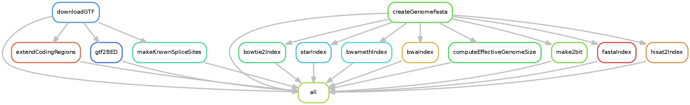

.. _createIndices:

createIndices
=============

What it does
------------

This is a special pipeline in that it creates index files required by various tools within snakePipes. This workflow takes as input a fasta file (or URL) and GTF file (or URL) as well as various optional files and generates both indices and the organism yaml file used by snakePipes.

Input requirements
------------------

The pipeline has two required inputs: a fasta file or URL and a GTF file or URL. These may both be gzipped. Optionally, you may specify a blacklist file (such as that provided by ENCODE), an effective genome size, and a file listing chromosomes to be ignored during normalization steps.

.. note:: If you specify a blacklist file, please ensure that regions within it do NOT overlap. Overlapping regions in this file will cause incorrect results in some tools. Further, it is best to flank blacklisted regions by at least 50 bases, as otherwise many reads originating within these regions may be nonetheless included.

Configuration file
~~~~~~~~~~~~~~~~~~

There is a configuration file in ``snakePipes/workflows/createIndices/defaults.yaml``::

    pipeline: createIndices
    outdir:
    configFile:
    clusterConfigFile:
    local: false
    maxJobs: 5
    verbose: False
    ## Genome name used in snakePipes (no spaces!)
    genome:
    ## Tools to create indices for. "all" for all of them
    tools: all
    ## URLs or paths for fasta and GTF files
    genomeURL:
    gtfURL:
    ## The effective genome size
    effectiveGenomeSize: 0
    ## Regions to blacklist in the ChIP-seq and related workflows
    blacklist:
    ## Regions to ignore during normalization (e.g., with bamCompare)
    ignoreForNorm:

These values are most conveniently set on the command line.

Output structure
----------------

The following structure will be created in the designated ``outdir``::

    .
    ├── annotation
    │   ├── blacklist.bed
    │   ├── genes.bed
    │   ├── genes.gtf
    │   └── genes.slop.gtf
    ├── BowtieIndex
    ├── BWAIndex
    ├── BWAmethIndex
    ├── createIndices.cluster_config.yaml
    ├── createIndices.config.yaml
    ├── createIndices_run-1.log
    ├── genome_fasta
    │   ├── effectiveSize
    │   ├── genome.2bit
    │   ├── genome.fa
    │   └── genome.fa.fai
    ├── HISAT2Index
    └── STARIndex

These files are used internally within snakePipes and don't require further inspection. The ``createIndices_run-1.log`` file contains a full log and will include the URLs or file paths that you specified. Whether the ``annotation/blacklist.bed`` file exists is dependent upon whether you specified one. The ``genome_fasta/effectiveSize`` fill will have the effective genome size (if you didn't specify it, the number of non-N bases in the genome will be used).

In addition to these, an organism yaml file will be created. Its location can be found with ``snakePipes info``.

.. note:: The astute observer will note that no Salmon index is created. This is intentional and done to facilitate users changing which transcripts should be included on the fly.

Command line options
--------------------

.. argparse::
    :func: parse_args
    :filename: ../snakePipes/workflows/createIndices/createIndices
    :prog: createIndices
    :nodefault:
