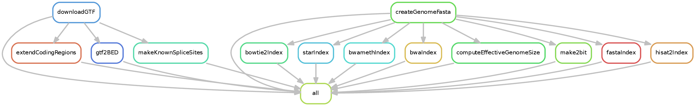
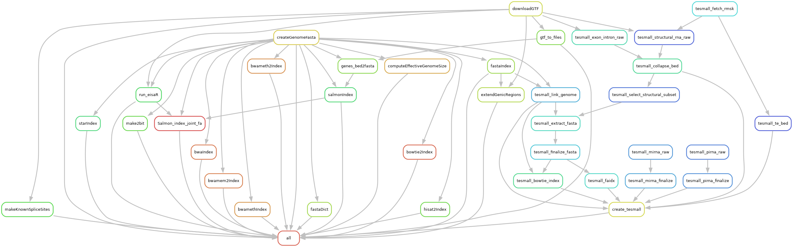

.. _createIndices:

createIndices
=============

What it does
------------

This is a special pipeline in that it creates index files required by various tools within snakePipes. This workflow takes as input a fasta file (or URL) and GTF file (or URL) as well as various optional files and generates both indices and the organism yaml file used by snakePipes.

Input requirements
------------------

The pipeline has two required inputs: a fasta file or URL and a GTF file or URL. These may both be gzipped. Optionally, you may specify a blacklist file (such as that provided by ENCODE), an effective genome size, and a file listing chromosomes to be ignored during normalization steps.

.. note:: If you specify a blacklist file, please ensure that regions within it do NOT overlap. Overlapping regions in this file will cause incorrect results in some tools. Further, it is best to flank blacklisted regions by at least 50 bases, as otherwise many reads originating within these regions may be nonetheless included.

Configuration file
~~~~~~~~~~~~~~~~~~

There is a configuration file in ``snakePipes/workflows/createIndices/defaults.yaml``::

    pipeline: createIndices
    outdir:
    configFile:
    clusterConfigFile:
    local: False
    maxJobs: 5
    verbose: False
    ## Genome name used in snakePipes (no spaces!)
    genome:
    ## Tools to create indices for. "all" for all of them
    tools: all
    ## URLs or paths for fasta and GTF files
    genomeURL:
    spikeinGenomeURL:
    spikeinExt: '_spikein'
    gtfURL:
    spikeinGtfURL:
    ## The effective genome size
    effectiveGenomeSize: 0
    ## Regions to blacklist in the ChIPseq and related workflows
    blacklist:
    spikeinBlacklist:
    ## Regions to ignore during normalization (e.g., with bamCompare)
    ignoreForNormalization:
    ## Repeat masker file. It's assumed that the columns are tab separated!
    rmsk_file:
    ## Salmon Index Options
    salmonIndexOptions: --type puff -k 31
    eisaR_flank_length: 80

These values are most conveniently set on the command line.

Hybrid genome
-------------

To create a hybrid fasta, specify the host genome with ``--genomeURL`` and the spikein genome with ``--spikeinGenomeURL``. On top of ``--gtfURL`` and ``--blacklist``, you may optionally provide ``--spikeinGtfURL`` and `--spikeinBlacklist`. Default extention added to spikein chromosomes is '_spikein' and can be changes with ``--spikeinExt``.

TEsmall-compatible genome (for smRNAseq)
-----------------------------------------

To use the :ref:`smRNAseq` workflow, the target genome must additionally be prepared with the
``--tesmall`` flag (which requires ``--gtfURL``)::

    createIndices -o /path/to/output --genome <genomeURL> --gtf <gtfURL> --tesmall --tesmallGenome mm10 mm10

This builds `TEsmall <https://github.com/mhammell-laboratory/TEsmall>`__'s reference database:
exon/intron/structural-RNA annotation extracted from the GTF, transposable-element annotation from
RepeatMasker, miRNA/piRNA annotation (with liftOver where needed) from miRBase/piRNAdb, and bowtie
indices of the genome, tDNA and rDNA sequences and records where TEsmall should look for it
(``tesmall_db``/``tesmall_genome``) in the resulting organism YAML.

``--tesmallGenome`` selects the UCSC/Ensembl build (e.g. ``mm10``, ``hg38``, ``mm39``, ``dm6``) used
to fetch this RepeatMasker/miRBase/piRNAdb reference data, and defaults to the ``GENOME`` positional
argument, but ``GENOME`` is just a free-form label used to name the organism YAML, so if it isn't
itself a recognized build (e.g. you're naming it ``GRCm38_release93``), set ``--tesmallGenome``
explicitly ex. ``--tesmallGenome mm10``. Recognized builds (and their aliases) are human
``hg19``/``GRCh37`` and ``hg38``/``GRCh38``, mouse ``mm9``/``NCBI37``, ``mm10``/``GRCm38`` and
``mm39``/``GRCm39``, and fly ``dm3``/``Release_5`` and ``dm6``/``Release_6``.

miRBase and piRNAdb each ship their annotation pinned to one specific build per species, which does
not always match the build you passed to ``--tesmallGenome``. When they differ, this step
automatically downloads the corresponding `UCSC liftOver chain <https://hgdownload.soe.ucsc.edu/goldenPath/>`__
and lifts the annotation over: no action is needed on your part, but it does mean the source and
target builds must be from the same species and a chain file must exist for that specific pair. For
ex. piRNAdb's mouse annotation is pinned to ``mm10``: preparing an ``mm39`` genome triggers an
automatic ``mm10`` -> ``mm39`` liftOver of the piRNA annotation, while its miRNA/hairpin annotation
(miRBase) may already ship against ``mm39`` and require no lift at all. Preparing an ``mm10`` genome,
conversely, needs no liftOver for piRNAdb but may still need one for miRBase, depending on which
build miRBase currently publishes. 

When ``--tesmall`` is used, the DAG gains the following branch (shown here for a run with
``--tesmall --tesmallGenome mm10``; the ``createGenomeFasta``/``downloadGTF`` side of the DAG is
unchanged from the diagram above):

Output structure
----------------

The following structure will be created in the designated ``outdir``::

    .
    ├── annotation
    ├── BowtieIndex
    ├── BWAIndex
    ├── BWAmethIndex
    ├── createIndices.cluster_config.yaml
    ├── createIndices.config.yaml
    ├── createIndices_run-1.log
    ├── genome_fasta
    ├── HISAT2Index
    ├── STARIndex
    ├── SalmonIndex
    ├── SalmonIndex_RNAVelocity
    └── TEsmall
        └── genomes
            └── <tesmallGenome>
                ├── annotation
                └── sequence

These files are used internally within snakePipes and don't require further inspection. The ``createIndices_run-1.log`` file contains a full log and will include the URLs or file paths that you specified. Whether the ``annotation/blacklist.bed`` file exists is dependent upon whether you specified one. The ``genome_fasta/effectiveSize`` fill will have the effective genome size (if you didn't specify it, the number of non-N bases in the genome will be used). The ``TEsmall`` folder is only created if ``--tesmall`` was specified, and is what the :ref:`smRNAseq` workflow's ``tesmall_db``/``tesmall_genome`` organism-YAML entries point to.

In addition to these, an organism yaml file will be created. Its location can be found with ``snakePipes info``.

Command line options
--------------------

.. argparse::
    :func: parse_args
    :filename: ../snakePipes/workflows/createIndices/createIndices.py
    :prog: createIndices
    :nodefault:
