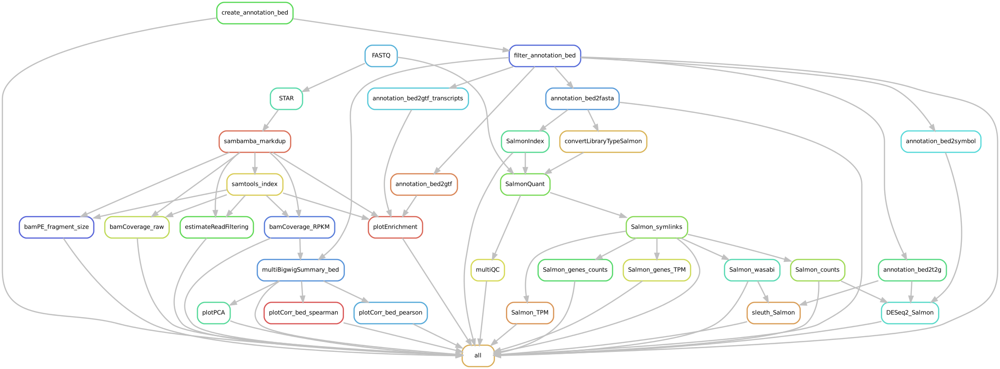

.. _mRNAseq:

mRNAseq
========

What it does
------------

The snakePipes mRNAseq workflow allows users to process their single or paired-end
mRNAseq fastq files upto the point of gene/transcript-counts and differential expression.
It also allows full allele-specific mRNAseq analysis (up to allele-specific
differential expression) using the *allelic-mapping* mode.

Input requirements
------------------

The only requirement is a directory of gzipped fastq files. Files could be single or paired end, and the read extensions could be modified using the keys in the ``defaults.yaml`` file below.

.. _RNAconfig:

Configuration file
~~~~~~~~~~~~~~~~~~

There is a configuration file in ``snakePipes/workflows/mRNAseq/defaults.yaml``::

    pipeline: rna-seq
    outdir:
    configFile:
    clusterConfigFile:
    local: False
    maxJobs: 5
    ## directory with fastq files
    indir:
    ## preconfigured target genomes (mm9,mm10,dm3,...) , see /path/to/snakemake_workflows/shared/organisms/
    ## Value can be also path to your own genome config file!
    genome:
    ## FASTQ file extension (default: ".fastq.gz")
    ext: '.fastq.gz'
    ## paired-end read name extension (default: ["_R1", "_R2"])
    reads: ["_R1","_R2"]
    ## assume paired end reads
    pairedEnd: True
    ## Number of reads to downsample from each FASTQ file
    downsample:
    ## Options for trimming
    trim: False
    trimmer: cutadapt
    trimmerOptions:

    ## three prime seq options
    # fastp options for three prime sequencing only
    threePrimeTrimmerOptions: -x --poly_x_min_len 6 -3 5 -q 5 -l 20 -y
    # STAR fastp options for three prime sequencing only
    threePrimeAlignerOptions: --limitBAMsortRAM 60000000000 --alignIntronMax 1UMIDedupOpts: --paired
    # parameters for calling polyA/T stretches in three_prime_seq workflow
    polyAT:
      minlength: 6
      mindistance: 25 # recommendation for Drosophila; for other genomes might be different
      extend: 3 # recommendation from Andrew 
      windowlength: 10
      percbase: 0.7

    # parameters for geneAssociation rule in three_prime_seq workflow
    geneAssociation:
      extend: 500

    # parameters for cmatrix_raw in three_prime_seq workflow
    cmatrix_raw:
      upstream: 500
      downstream: 500

    clusterPAS:
      window: 15

    ## further options
    mode: alignment,deepTools_qc
    sampleSheet:
    rMats: False
    bwBinSize: 25
    fastqc: False
    featureCountsOptions: -C -Q 10 --primary
    filterGTF:
    fragmentLength: 200
    libraryType: 2
    dnaContam: False
    ## supported mappers: STAR HISAT2
    aligner: STAR
    alignerOptions:
    verbose: False
    plotFormat: png
    # for allele-spcific mapping
    SNPFile:
    NMaskedIndex:
    #### Flag to control the pipeline entry point
    fromBAM: False
    bamExt: '.bam'
    #umi_tools
    UMIBarcode: False
    bcPattern: NNNNCCCCCCCCC #default: 4 base umi barcode, 9 base cell barcode (eg. RELACS barcode)
    UMIDedup: False
    UMIDedupSep: "_"
    UMIDedupOpts: --paired

Apart from the common workflow options (see :ref:`running_snakePipes`), the following parameters are useful to consider:

* **aligner**: You can choose either `STAR <https://github.com/alexdobin/STAR>`__ or `HISAT2 <https://ccb.jhu.edu/software/hisat2/index.shtml>`__. While HISAT2 requires less memory than STAR, we keep STAR as the default aligner due to its superior accuracy (see `this paper <https://www.nature.com/nmeth/journal/v14/n2/abs/nmeth.4106.html>`__). Make sure that ``--alignerOptions`` matches this.

* **alignerOptions**: Options to pass on to your chosen aligner. Note that library type and junction definitions doesn't have to be passed to the aligners as options, as they are handeled either automatically, or via other parameters.

* **featureCountsOptions**: Options to pass to featureCounts (in case the ``alignment`` or ``allelic-mapping`` mode is used). Note that the paired-end information is automatically passed to featurecounts via the workflow, and the summerization is always performed at **gene level**, since the workflow assumes that featurecounts output is being used for gene-level differential expression analysis. If you wish to perform a **transcript-level** DE analysis, please choose the mode **alignment-free**.

* **filterGTF**: Options you can pass on to filter the original `GTF file <http://genome.ucsc.edu/goldenPath/help/customTrack.html#GTF>`__. This is useful in case you want to filter certain kind of transcripts (such as pseudogenes) before running the counts/DE analysis.

* **libraryType**: The default library-type is suitable for most RNAseq protocols (using Illumina `Tru-Seq <https://www.illumina.com/products/by-type/sequencing-kits/library-prep-kits/truseq-rna-v2.html>`__). Change this option in case you have a different strandednes.

* **salmonIndexOptions**: In the ``alignment-free`` mode (see below), this option allows you to change the type of index created by salmon. New users can leave it to default.

* **dnaContam**: Enable this to test for possible DNA contamination in your mRNAseq samples. DNA contamination is quantified as the fraction of reads falling into intronic and intergenic regions, compared to those falling into exons. Enabling this option would produce a directory called ``GenomicContamination`` with ``.tsv`` files containing this information.

* **plotFormat**: You can switch the type of plot produced by all deeptools modules using this option. Possible choices : png, pdf, svg, eps, plotly

* **SNPFile**: For the ``allelic-mapping`` mode. The ``SNPFile`` is the file produced by `SNPsplit <https://www.bioinformatics.babraham.ac.uk/projects/SNPsplit/>`__ after creating a dual-hybrid genome. The file has the suffix ``.vcf``.

* **NMaskedIndex**: For the ``allelic-mapping`` mode. The ``NMaskedIndex`` refers to the **basename** of the index file created using STAR, on the SNPsplit output.

.. note:: SNPFile and NMaskedIndex file could be specified in case you already have this and would like to re-run the analysis on new data. In case you are running the allele-specific analysis for the first time, you would need a VCF file and the name of the two strains. In this case the ``SNPFile`` as well as the ``NMaskedIndex`` files would be automatically created by the workflow using SNPsplit.

Differential expression
-----------------------

Like the other workflows, differential expression can be performed using the ``--sampleSheet`` option and supplying a sample sheet like that below::

    name    condition
    sample1      eworo
    sample2      eworo
    SRR7013047      eworo
    SRR7013048      OreR
    SRR7013049      OreR
    SRR7013050      OreR

.. note:: The first entry defines which group of samples are control. This way, the order of comparison and likewise the sign of values can be changed. The DE analysis might fail if your sample names begin with a number. So watch out for that!

Optionally, the user may submit their desired model formula (without the leading tilda ``~``)  with ``--formula``.

Differential Splicing
---------------------

In addition to differential expression, differential splicing analysis can be performed by using ``--rMats`` option in addition to supplying a sample sheet. This will invoke the rMats turbo on the samples.

Complex designs with blocking factors
~~~~~~~~~~~~~~~~~~~~~~~~~~~~~~~~~~~~~

If the user provides additional columns between 'name' and 'condition' in the sample sheet, the variables stored there will be used as blocking factors in the order they appear in the sample sheet. Eg. if the first line of your sample sheet looks like 'name	batch	condition', this will translate into a formula ``batch + condition``. 'condition' has to be the final column and it will be used for any statistical inference.

Multiple pairwise comparisons
~~~~~~~~~~~~~~~~~~~~~~~~~~~~~

The user may specify multiple groups of independent comparisons by providing a 'group' column after the 'condition' column. This will cause the sample sheet to be split into the groups defined in this column, and a corresponding number of independent pairwise comparisons will be run, one for each split sheet, and placed in separate output folders named accordingly. This will be applied to DESeq2, sleuth, and rMats pairwise comparisons as requested by the user.
Specifying a value of 'All' in the 'group' column will cause that sample group to be used in all pairwise comparisons, e.g. if the same set of controls should be used for several different treatment groups.

An example sample sheet with the group information provided looks like this:

name	condition	group
sample1	Control		All
sample2	Control		All
sample3	Treatment	Group1
sample4	Treatment	Group1
sample5	Treatment	Group2
sample6	Treatment	Group2

Analysis modes
--------------

Following analysis (**modes**) are possible using the mRNAseq workflow:

"alignment"
~~~~~~~~~~~

In this mode,
the pipeline uses one of the selected aligners to create BAM files, followed by
gene-level quantification using **featureCounts**. Gene-level differential expression
analysis is then performed using **DESeq2**.

"allelic-mapping"
~~~~~~~~~~~~~~~~~

**allelic-mapping** mode follows a similar process as the "mapping" mode, however the
alignment performed on an allele-masked genome, followed by allele-specific splitting
of mapped files. Gene-level quantification is performed for each allele using **featureCounts**.
Allele-specific, gene-level differential expression analysis is then performed using **DESeq2**.

.. note:: **allelic-mapping** mode is mutually exclusive with **mapping** mode

"allelic-counting"
~~~~~~~~~~~~~~~~~~

**allelic-counting** mode requires the user to input, per sample, 4 bam files, corresponding to haplotype1, haplotype2, unassigned and haplotagged , e.g. as generated by whatshap. The respective suffixes ".genome1", ".genome2", ".unassigned", ".alelle_flagged" are required to be followed by the bam extention ".sorted.bam". This mode is mutually exclusive with "deepTools_qc". Only the allelic version of deepTools qc will be run, by default. Allelic version of featureCounts will be run by default. If sample sheet is provided, allelic DESeq2- or allelic Salmon-based differential gene expression analysis will be run. 

"alignment-free"
~~~~~~~~~~~~~~~~

In this mode,
the pipeline uses **salmon** to perform transcript-level expression quantification. This mode
performs both transcript-level differential expression (using **Sleuth**), and gene-level
differential expression (using **wasabi**, followed by **DESeq2**).

.. note:: The salmon index is recreated each time in alignment-free mode. This is done to facilitate changing how the GTF file is filtered, which necessitates reindexing.

"deepTools_qc"
~~~~~~~~~~~~~~

The pipeline provides multiple quality controls through deepTools, which can be triggered
using the **deepTools_qc** mode. It's a very useful add-on with any of the other modes.

.. note:: Since most deeptools functions require an aligned (BAM) file, the deepTools_qc mode will additionally perform the alignment of the fastq files. However this would not interfere with operations of the other modes.

"threePrimeSeq"
~~~~~~~~~~~~~~~

**threePrimeSeq** uses a pipeline developed by the Hilgers lab to annotate and 
count clusters of reads mapping to three prime ends of genes using 
poly(T)VN-primed 3' sequencing kits such as Lexogen's 3' mRNAseq kit. 
In this mode, **fastp** is used to pretrim with preset parameters, followed by 
**STAR** mapping. 

First, a blacklist of possible internal priming sites is generated for the 
given organism. Next, the mapped regions are filtered according to this
blacklist and associated with the nearest gene within a certain window. 
For all samples within the run, a database of PAS sites is generated
and read counts aggregated for each particular site. These are then 
summarized on a metagene level and output to a counts.tsv file for 
further downstream analysis. 

The output for this mode will be stored in the ``three_prime_seq/`` subfolder. 

.. note:: The ``--three-prime-seq`` option must be invoked (which will also set mode to threePrimeSeq) as this will set **fastp** and **STAR** with the appropriate parameters. 

Understanding the outputs
---------------------------

Assuming the pipline was run with ``--mode alignment-free,alignment,deepTools_qc``::

    ├── Annotation
    ├── bamCoverage
    ├── cluster_logs
    ├── deepTools_qc
    │   ├── bamPEFragmentSize
    │   ├── estimateReadFiltering
    │   ├── logs
    │   ├── multiBigwigSummary
    │   ├── plotCorrelation
    │   ├── plotEnrichment
    │   └── plotPCA
    ├── DESeq2_Salmon_sampleSheet
    ├── DESeq2_sampleSheet
    ├── FASTQ
    ├── featureCounts
    ├── multiQC
    ├── QC_report
    ├── mRNAseq.cluster_config.yaml
    ├── mRNAseq.config.yaml
    ├── mRNAseq_organism.yaml
    ├── mRNAseq_pipeline.pdf
    ├── mRNAseq_run-1.log
    ├── Salmon
    ├── sleuth_Salmon_sampleSheet
    └── STAR

.. note:: The ``_sampleSheet`` suffix for the ``DESeq2_sampleSheet`` and ``sleuth_Salmon_sampleSheet`` is drawn from the name of the sample sheet you use. So if you instead named the sample sheet ``mySampleSheet.txt`` then the folders would be named ``DESeq2_mySampleSheet`` and ``sleuth_Salmon_mySampleSheet``. This facilitates using multiple sample sheets.

Apart from the common module outputs (see :ref:`running_snakePipes`), the workflow would produce the following folders:

* **Annotation**: This folder would contain the GTF and BED files used for analysis. In case the file has been filtered using the ``--filterGTGTFF`` option (see :ref:`RNAconfig`), this would contain the filtered files.

* **STAR/HISAT2**: (not produced in mode *alignment-free*) This would contain the output of RNA-alignment by STAR or HISAT2 (indexed `BAM files <http://samtools.github.io/hts-specs/SAMv1.pdf>`__).

* **featureCounts**: (not produced in mode *alignment-free*) This would contain the gene-level counts (output of `featureCounts <http://bioinf.wehi.edu.au/featureCounts/>`__), on the filtered GTF files, that can be used for differential expression analysis.

* **bamCoverage**: (not produced in mode *alignment-free*) This would contain the bigWigs produced by deepTools `bamCoverage <https://deeptools.readthedocs.io/en/develop/content/tools/bamCoverage.html>`__ . Files with suffix ``.coverage.bw`` are raw coverage files, while the files with suffix ``RPKM.bw`` are `RPKM-normalized <https://www.biostars.org/p/273537/>`__ coverage files.

* **deepTools_QC**: (produced in the mode *deepTools_QC*) This contains the quality checks specific for mRNAseq, performed via deepTools. The output folders are names after various deepTools functions and the outputs are explained under `deepTools documentation <deeptools.readthedocs.io>`__. In short, they show the insert size distribution(**bamPEFragmentSize**), mapping statistics (**estimateReadFiltering**), sample-to-sample correlations and PCA (**multiBigwigSummary, plotCorrelation, plotPCA**), and read enrichment on various genic features (**plotEnrichment**)

* **DESeq2_[sampleSheet]/DESeq2_Salmon_[sampleSheet]**: (produced in the modes *alignment* or *alignment-free*, only if a sample-sheet is provided.) The folder contains the HTML result report **DESeq2_report.html**, the annotated output file from DESeq2 (**DEseq_basic_DEresults.tsv**) and normalized counts for all samples, produced via DEseq2 (**DEseq_basic_counts_DESeq2.normalized.tsv**) as well as an Rdata file (**DEseq_basic_DESeq.Rdata**) with the R objects ``dds <- DESeq2::DESeq(dds)`` and ``ddr <- DDESeq2::results(dds,alpha = fdr)``. **DESeq2_[sampleSheet]** uses gene counts from ``featureCounts/counts.tsv``, whereas **DESeq2_Salmon_[sampleSheet]** uses transcript counts from ``Salmon/counts.tsv`` that are merged via tximport in R. Sample name to plotting shape mapping on the PCA plot is limited to 36 samples and skipped otherwise.

* **Salmon**: (produced in mode *alignment-free*) This folder contains transcript-level (``counts.tsv``)and gene-level (``counts.genes.tsv``) counts estimated by the tool `Salmon <https://salmon.readthedocs.io/en/latest/salmon.html>`__ .

* **sleuth_Salmon_[sampleSheet]** (produced in mode *alignment-free*, only if a sample-sheet is provided) This folder contains a transcript-level differential expression output produced using the tool `Sleuth <https://pachterlab.github.io/sleuth/about>`__ .

Command line options
--------------------

.. argparse::
    :func: parse_args
    :filename: ../snakePipes/workflows/mRNAseq/mRNAseq.py
    :prog: mRNAseq
    :nodefault:
