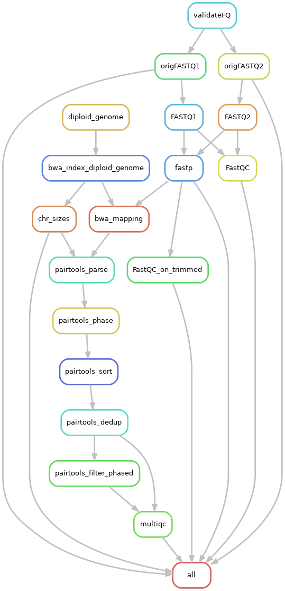

.. _makePairs:

makePairs
=========

What it does
------------

The snakePipes makePairs workflow allows users to process their HiC data from raw fastq files to HiC matrices in
an allele-specific manner. The workflow utilized mapping by bwa, followed by analysis
using `pairtools <https://www.ncbi.nlm.nih.gov/pmc/articles/PMC9949071/>`__ . The workflow follows the `example workflow described in the documentation of pairtools <https://pairtools.readthedocs.io/en/latest/examples/pairtools_phase_walkthrough.html>`__ , 
which explains each step in detail and would be useful for new users to have a look at. 
Currently the output matrices are produced in the `.pairs <https://pairtools.readthedocs.io/en/latest/formats.html>`__ format.

Input requirements and outputs
------------------------------

This pipeline requires paired-end reads fastq files as input in order to build allele-specific contact matrices.
The input fastq files will be trimmed (with fastp) and be mapped against a diploid reference genome (with bwa).

Prior to building the matrix, the pipeline generates two reference genomes (from a reference genome and a VCF file) that contains the information
on haplotypes. The Haplotypes are set using the `--strains` flag. The two reference genomes are then merged to yield one reference genome
(genome/diploid_genome.fa) which is indexed with `bwa` as the basis for mapping of paired-end reads. (Notice that this is different from the mono-allelic HiC workflow 
which map reads individually in single-end mode and combines them into contact pairs afterwards.

The output of mapping step is used by `pairtools`` to construct different contact matrices for each sample (in pairs format)

Workflow configuration file
---------------------------

Default parameters from the provided config file can be altered by user. Below is
the config file description for the makePairs workflow :

.. parsed-literal::

        pipeline: makePairs
        outdir:
        configFile:
        clusterConfigFile:
        local: False
        maxJobs: 5
        ## directory with fastq files
        indir:
        ## preconfigured target genomes (mm9,mm10,dm3,...) , see /path/to/snakemake_workflows/shared/organisms/
        ## Value can be also path to your own genome config file!
        genome:
        ## FASTQ file extension (default: ".fastq.gz")
        ext: '.fastq.gz'
        ## paired-end read name extension (default: ["_R1", "_R2"])
        reads: ["_R1","_R2"]
        ## assume paired end reads
        pairedEnd: True
        ## Number of reads to downsample from each FASTQ file
        downsample:
        ## Options for trimming
        trim: True
        trimmer: fastp
        trimmerOptions:

        verbose: False
        fastqc: True
        UMIBarcode: False
        bcPattern: "NNNNCCCCCCCCC"
        UMIDedup: False
        UMIDedupSep: "_"
        UMIDedupOpts: "_"
        plotFormat: png
        bwBinSize: 1000
        aligner: 'bwa'
        alignerOptions: '-SPu -T0'
        alignerThreads: 30

        fromBAM: False
        sampleSheet:

 
      ################################################################################
      # Call snakemake directly, i.e. without using the wrapper script:
      #
      # Please save a copy of this config yaml file and provide an adjusted config
      # via '--configFile' parameter!
      # example call:
      #
      # snakemake --snakefile /path/to/snakemake_workflows/workflows/makePairs/Snakefile
      #           --configFile /path/to/snakemake_workflows/workflows/makePairs/defaults.yaml
      #           --directory /path/to/outputdir
      #           --VCFfile /path/to/vcf_file
      #           --strains strain1_name,strain2_name
      #           --cores 32
      ################################################################################

Structure of output directory
-----------------------------

In addition to the FASTQ module results (see :ref:`running_snakePipes`), the workflow produces the following outputs::

    .
    |-- bam
    |-- FASTQ
    |-- FastQC
    |-- FastQC_trimmed
    |-- FASTQ_fastp
    |-- genome
    |-- multiqc
    |-- originalFASTQ
    |-- pairs
    |-- phase_stats
 

* **bam** folder contains the mapping results in BAM format. The files were obtained after running `bwa <https://github.com/lh3/bwa>`__ in paired-end mode.

* **originalFASTQ** includes softlinks to the original FASTQ data

* **FASTQ** links to **originalFASTQ** if no further filters are specified

* **FASTQ_fastp**: trimmed FASTQ files output by fastp

* **FastQC** FASTQC report on FASTQ directory 

* **genome** folder contains the diploid_genome.fa.gz that was constructed from 2 strain-specific genomes with rule diploid_genome.  Chromosome sizes and indices (bwa) can also be found in this directory

* **multiqc** folder contains  the final QC report generated with MultiQC (including fastqc, fastp, and pairtools modules)

.. note:: For the pairtools modules to work we used `MultiQC from open2c <https://github.com/open2c/MultiQC.git>`__ as specified for the makePiars environment

* **pairs** folder contains the parsed, phased, sorted and deduplicated contact matrices generated by pairtools. 

* **phase_stats** contains the 4 subsetted pairs files for each sample (unphased pairs, 2 different strains, trans pairs). QC statistics are also calculated and will be processed by MultiQC

Command line options
--------------------

.. argparse::
    :func: parse_args
    :filename: ../snakePipes/workflows/makePairs/makePairs.py
    :prog: makePairs
    :nodefault:
