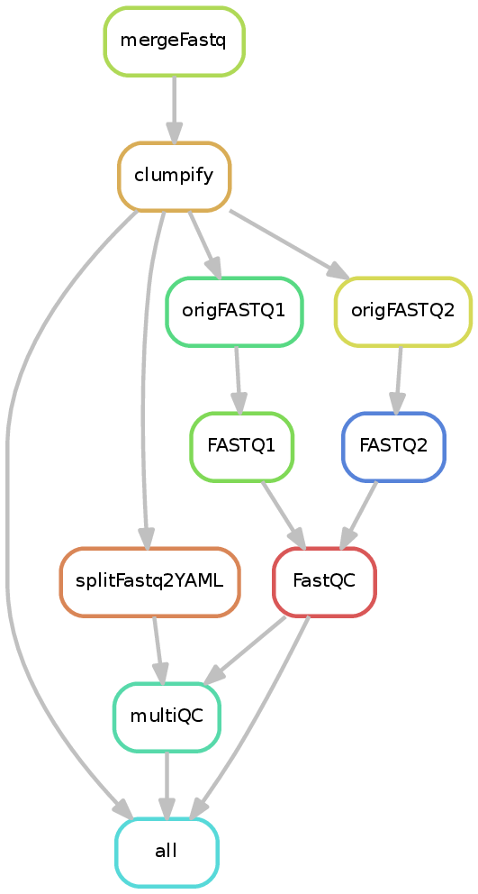

.. _preprocessing:

preprocessing
=============

What it does
------------

The preprocessing pipeline handles a few tasks that are commonly done by some, but not all, sequencing providers::

 * Merging samples across lanes (or technical replicates)
 * Removal of apparent optical duplicates
 * Reformatting fastq files to extract UMIs
 * Running FastQC

Input requirements
------------------

The minimal requirement is a directory of fastq files. If files should be merged (e.g., the sequencing provider did not merge
samples across lanes) then a sample sheet should also be provided of the following form::

        sample1_S1_L001_R1_001.fastq.gz _R1     sample1
        sample1_S1_L001_R2_001.fastq.gz _R2     sample1
        sample1_S1_L002_R1_001.fastq.gz _R1     sample1
        sample1_S1_L002_R2_001.fastq.gz _R2     sample1
        sample1_S1_L003_R1_001.fastq.gz _R1     sample1
        sample1_S1_L003_R2_001.fastq.gz _R2     sample1

The first column contains file names, the second the associated read 1/2 designator (this should match the ``--reads`` option), and finally the desired sample name.

Care should be given when setting ``--optDedupDist``, as values of 0 (the default) disable removal of optical duplicates. The appropriate value to use is sequencer-dependent.

Understanding the outputs
---------------------------

The preprocessing pipeline can generate the following files and directories (depending on the options given)::

    .
    ├── deduplicatedFASTQ
    │   ├── sample1.metrics
    │   ├── sample1_R1.fastq.gz
    │   ├── sample1_R1_optical_duplicates.fastq.gz
    │   ├── sample1_R2.fastq.gz
    │   ├── sample1_R2_optical_duplicates.fastq.gz
    │   └── optical_dedup_mqc.json
    ├── FASTQ
    ├── FastQC
    ├── mergedFASTQ
    ├── multiQC
    └── originalFASTQ

As shown above, the pipeline produces the following directories:

 * **mergedFASTQ** : If a sample sheet is given, this file contains the merged fastq files.
 * **deduplicatedFASTQ**: The results of optical duplicate removal (or symlinks to ``mergedFASTQ``). The "_optical_duplicates" files contain the reads marked by clumpify as being likely optical duplicates. The associated ".metrics" file contains two values: number of optical duplicates and then the total reads. The ``optical_dedup_mqc.json`` file merges the various sample metrics files for downstream use by MultiQC.
 * **originalFASTQ** : This folder exists from compatibility with other pipelines and will contain either symlinks to the original fastq files or, if a sample sheet is specified, those in ``deduplicatedFASTQ``.
 * **FASTQ**: Fastq files produced by UMI processing (or symlinks to ``originalFASTQ``).
 * **FastQC**: If the ``--fastqc`` parameter was given, the output of FastQC.
 * **multiQC**: If either FastQC was run or optical duplicates were removed, an interactive web report will be created using MultiQC.

Command line options
--------------------

.. argparse::
    :func: parse_args
    :filename: ../snakePipes/workflows/preprocessing/preprocessing.py
    :prog: Preprocessing
    :nodefault:
