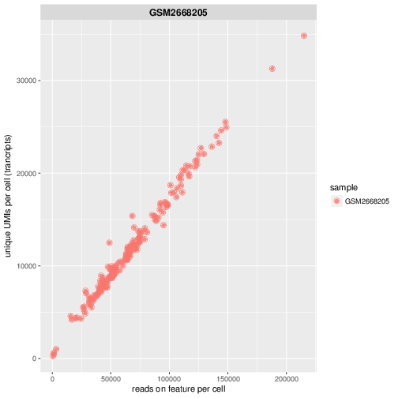
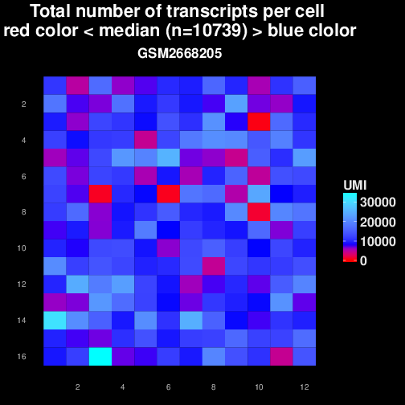

.. _scRNA-seq:

scRNA-seq
=========

What it does
------------

The scRNA-seq pipeline is intended to process UMI-based data, expecting the cell barcode and umi in Read1, and the cDNA sequence in Read2. 

There are currently two analysis modes available:
- "Gruen" to reproduce CellSeq2 data analysis by Gruen et al.
- "STARsolo" which uses STAR solo for mapping and quantitation.

The general procedure for mode "Gruen" involves:

1. moving cell barcodes and UMIs from read 1 into the read headers of read 2,
2. mapping read 2,
3. quantification at the single cell level.

Mode "Gruen" is going to be deprecated by the end of 2020.

The general procedure for mode "STARsolo" involves:

1. moving cell barcodes and UMIs from read 1 into the CB and UMI tags of read 2 during mapping (STARsolo),
2. quantification of genic read counts at the single cell level (STARsolo),
3. quantification of reads supporting spliced and unspliced transcripts in each cell (velocyto) - unless this has been disabled with --skipVelocyto
4. generation of seurat objects for genic counts.

UMIs in the read headers are used to avoid counting PCR duplicates. A number of bigWig and QC plots (e.g., from ``plotEnrichment``) are generated as well.

.. image:: ../images/scRNAseq_pipeline.png

Mode STARsolo
-------------

With current settings, this mode should work with any UMI-based protocol that stores UMI and CB in read 1, each in one chunk. 
The mode comes with four presets that can be passed to the ' --myKit ' argument: CellSeq192, CellSeq384, 10xV2, 10xV3. Choosing a preset will select a corresponding barcode whitelist file as well as cell barcode and umi length and positions to be used. Choosing the Custom preset allows the user to run the workflow providing own barcode whitelist and CB/UMI positions and lengths. CellSeq384 is the current default preset.

In this mode, STARsolo is used to map, UMI-deduplicate and count reads. Importantly, read 1 is expected to carry the UMI and the cell barcode, while read 2 is expected to carry the cDNA sequence. Default positions of UMI and CB in read 1 are specified, as well as their respective lengths. If your setup is different from the available presets, change it via the --STARsoloCoords commandline argument or in the defaults.yaml dictionary, in addition to providing --myKit Custom argument.

In the STARsolo folder, bam files are stored, along with 10x-format count matrices and log files summarizing barcode detection and UMI-deduplication.
Bam files have the UB and CB tags set.

Deeptools QC is run on these bam files.

Before running velocyto, bam files from STARsolo are filtered to remove unmapped reads as well as reads with an empty CB tag and then cell-sorted by the CB tag.
In the VelocytoCounts folder, loom files with counts of spliced, unspliced and ambiguous reads are stored. A merged loom file containing counts for all samples together can be found in the VelocytoCounts_merged folder. As Velocyto tends to consume a lot of memory and result in long runtimes with cell numbers in ~10^5, it can be disabled with --skipVelocyto.

Input requirements
------------------

The primary input requirement is a directory of paired-end fastq files. For the Gruen mode, if you do not wish to use the default list of cell-barcodes you must then supply your own, and to modify the cellBarcodePattern accordingly.. For the STAR solo mode, a barcode whitelist is required, as well as specification of UMI and CB positions and length, if different from default or available presets.

Cell barcodes
~~~~~~~~~~~~~

The format of the cell barcodes file is shown below. Note that the default file is included in the snakePipes source code under ``snakePipes/workflows/scRNAseq``. This file is automatically used if you leave :code:`cellBarcodeFile` empty.

::

    1       AGTGTC
    2       ACCATG
    3       GAGTGA
    4       CACTCA
    5       CATGTC
    6       ACAGGA
    7       GTACCA
    8       ACAGAC
    9       ACGTTG

The default cell barcodes in the Gruen mode are 192 hexamers listed in a file with the first column a cell number and the second the barcode sequence.

Predefined cell barcodes are required right now. However it is planned to make this more generic in future workflow versions.

Barcode whitelist
~~~~~~~~~~~~~~~~~

Required for the STARsolo mode. The expected format is a one-column txt file with barcodes the user wishes to retain. Default is a whitelist file for CellSeq2 384 barcodes, provided with the pipeline. If 'myKit' is changed to another available preset, the corresponding barcode whitelist provided with the pipeline will be used.

Configuration file
~~~~~~~~~~~~~~~~~~

The default configuration file is listed below and can be found in ``snakePipes/workflows/scRNAseq/defaults.yaml``::

    pipeline: scrna-seq
    outdir:
    configFile:
    clusterConfigFile:
    local: False
    maxJobs: 5
    ## directory with fastq files
    indir:
    ## preconfigured target genomes (mm9,mm10,dm3,...) , see /path/to/snakemake_workflows/shared/organisms/
    ## Value can be also path to your own genome config file!
    genome:
    ## FASTQ file extension (default: ".fastq.gz")
    ext: '.fastq.gz'
    ## paired-end read name extension (default: ["_R1", "_R2"])
    reads: ["_R1","_R2"]
    ##Analysis mode
    mode: STARsolo
    ## Number of reads to downsample from each FASTQ file
    downsample:
    ## Options for trimming
    trim: False
    trimmer: cutadapt
    trimmerOptions: -a A{'30'}
    ## N.B., setting --outBAMsortingBinsN too high can result in cryptic errors
    alignerOptions: "--outBAMsortingBinsN 30 --twopassMode Basic"
    ## further options
    filterGTF: "-v -P 'decay|pseudogene' "
    cellBarcodeFile:
    cellBarcodePattern: "NNNNNNXXXXXX"
    splitLib: False
    cellNames:
    ##STARsolo options
    myKit: CellSeq384
    BCwhiteList:
    STARsoloCoords: ["1","7","8","7"]
    #generic options
    libraryType: 1
    bwBinSize: 10
    verbose: False
    plotFormat: pdf
    dnaContam: False
    ## Parameters for th statistical analysis
    cellFilterMetric: gene_universe
    #Option to skip RaceID to save time
    skipRaceID: False
    #umi_tools options:
    UMIBarcode: False
    bcPattern: NNNNCCCCCCCCC #default: 4 base umi barcode, 9 base cell barcode (eg. RELACS barcode)
    UMIDedup: False
    UMIDedupSep: "_"
    UMIDedupOpts: --paired

While some of these can be changed on the command line, you may find it useful to change ``cellBarcodePattern`` and ``cellBarcodeFile`` if you find that you need to change them frequently.

Barcode pattern
~~~~~~~~~~~~~~~

The scRNA-seq pipeline requires barcodes at 5' end of read 1. The default cellBarcodePattern takes the first 6 bases as UMI (NNNNNN) and the following 6 bases as cell barcode (XXXXXX).
If your read/barcode layout requires additional **'Don't care'** positions eg. before stretches of N one can indicate these with ``.``

Barcode file
~~~~~~~~~~~~~~~

Only specify a file if you use other than the default CEL-seq2 barcodes (mode Gruen).

Trimming
~~~~~~~~

It is recommended to use the :code:`--trim` option as this uses cutadapt to trim remaining adapters *and* poly-A tails from read 2 (see defaults for ``--trimmerOptions``).

Pseudogene filter
~~~~~~~~~~~~~~~~~

As default, transcripts or genes that contain that are related to biotypes like 'pseudogene' or 'decay' are filtered out before tag counting (see
:code:`--filterGTF` default).
Here we assume you provide eg. a gencode or ensemble annotation file (via genes_gtf in the organism configuration yaml) that contains this information.

Library Type
~~~~~~~~~~~~

The CEL-seq2 protocol produces reads where read 2 maps in sense direction (:code:`libraryType: 1`). After barcodes are transferred to read 2, the workflow continues in single-end mode.

Split lib
~~~~~~~~~

This option you need in case a library contains only 96 instead of 192 cells (mode Gruen).

Output structure
----------------

The following will be produced in the output directory when the workflow is run in mode Gruen::

    |-- cluster_logs
    |-- Filtered_cells_RaceID
    |   `-- logs
    |-- Filtered_cells_monocle
    |    `-- logs
    |-- cellQC_test
    |-- mtab_test
    |-- QC_report
    |   `-- data
    |-- Results
    |-- Counts
    |   `-- logs
    |-- multiQC
    |   `-- multiqc_data
    |-- bamCoverage
    |   `-- logs
    |-- deepTools_qc
    |   |-- logs
    |   |-- bamPEFragmentSize
    |   |-- plotEnrichment
    |   `-- estimateReadFiltering
    |-- Sambamba
    |-- STAR_genomic
    |   |-- logs
    |   `-- GSM2668205
    |-- FastQC
    |   `-- logs
    |-- Annotation
    |-- FASTQ_barcoded
    `-- FASTQ

 - The **Annotation** directory contains a filtered version of your original GTF file, with pseudogenes removed by default.
 - The **bamCoverage** directory contains a bigwig track for each sample (not per cell!). This can be used eg. in IGV to check where your reads map in general.
 - The **Counts** directory contains 4 sets of counts: UMIs/feature/cell (.umis.txt), reads/feature/cell (.reads.txt), corrected number of UMIs/feature/cell (corrected.txt) and raw counts per cell per UMI per feature (raw_counts.txt). Of these, the values in corrected.txt should be used for further analysis and the others for quality control.
 - The **deeptools_qc** directory contains additional QC reports and plots. The ``FASTQC`` directory can be used to verify eg. the barcode layout of read 1.
 - The **QC_report** directory contains additional QC stats as tables and plots.

The following will be produced in the output directory when the workflow is run in mode STARsolo::

    analysis/
    ├── scRNAseq_run-1.log
    ├── multiQC
    ├── deepTools_qc
    ├── cluster_logs
    ├── bamCoverage
    ├── Sambamba
    ├── filtered_bam
    ├── STARsolo
    ├── Seurat
    ├── Annotation
    ├── FastQC
    ├── originalFASTQ
    ├── scRNAseq_tools.txt
    ├── scRNAseq.cluster_config.yaml
    ├── scRNAseq.config.yaml
    └── scRNAseq_organism.yaml

 - The **VelocytoCounts** directory contains loom files in sample subdirectories.
 - The **VelocytoCounts_merged** directory containes one loom file with all samples merged.
 - The **STARsolo* directory contains bam files and 10X-format cell count matrices produced by STARsolo.

The remaining folders are described in the Gruen mode above.

Understanding the outputs: mode Gruen
--------------------------------------

- **Main result:** the genes per cell count table with poisson-corrected counts can be found under ``Results/all_samples.gencode_genomic.corrected_merged.csv``

- Corresponding annotation files are: ``Annotation/genes.filtered.bed`` and ``Annotation/genes.filtered.gtf``, respectively.

- The folders ``QC_report``, ``FASTQC``, ``deeptools_qc`` and ``multiQC`` contain various QC tables and plots.

- **Sambamba** and **STAR_genomic** directories contain the output file from duplicate marking and genomic alignments, respectively.

Understanding the outputs: mode STARsolo
----------------------------------------

- **Main result:** output folders with 10x-format count matrices can be found in sample subfolders under ``STARsolo``. The ouput consists of three files: barcodes.tsv, features.tsv, matrix.mtx. Their gzipped versions are stored in the same folder. Seurat objects from merged samples are available in the ``Seurat`` folder.

- Corresponding annotation files are: ``Annotation/genes.filtered.bed`` and ``Annotation/genes.filtered.gtf``, respectively.

- The folders ``QC_report``, ``FASTQC``, ``deeptools_qc`` and ``multiQC`` contain various QC tables and plots.

- *STARsolo* directory contain the output from genomic alignments.

Filtered_cells_monocle
~~~~~~~~~~~~~~~~~~~~~~

The poisson-rescaled count matrix is read and converted into a monocle dataset. A range of transcript counts per cell thresholds (from 1000 to 5000 by 500) are applied to filter cells and the resulting R objects are written to minT*.mono.set.RData. For every cell filtering threshold, several metrics are collected and written to metrics.tab.txt: number of retained cells, median number of expressed genes per cell (GPC), size of the total gene universe. Plots of median GPC as well as gene universe size as functions of the cell filtering threshold are written to medGPCvsminT.downscaled.png and gene_universevsminT.downscaled.png, respectively.

The optimal cell filtering threshold for the subsequent analyses is selected as the value that results in maximizing a gene expression metric choosable from "gene_universe" (default) and "medGPC". Using gene universe tends to maximize the overall cell diversity while using median genes per cell (medGPC) maximizes the information content per cell.
Gene expression dispersions are calculated for the corresponding monocle object and the trend plot is written to mono.set.*.disp.estim.png. A first iteration of cell clustering with default settings resutls in a rho-delta plot written to mono.set.*.rho_delta.png and a tSNE plot with cell cluster colouring written to mono.set.*.tsne.auto.Cluster.png. Rho and delta are now re-evaluated and set to the 80th and the 95th percentiles of the original distributions, respectively. Cells are reclustered and the corresponding tSNE plot is written to mono.set.*.tsne.thd.Cluster.png. The monocle object containing the updated clustering information is written to minT*.mono.set.RData. It is also converted to a seurat object and the clustering information is transferred. The seurat object is saved as minT*.seuset.RData. The tSNE plot with clustering information produced with seurat is written to minT*.seuset.tSNE.png.
Top10 as well as top2 markers are calculated for each cell cluster and written to minT\*.Top10markers.txt and minT\*.Top2markers.txt, respectively. The corresponding heatmaps are written to minT\*.Top10markers.heatmap.png and minT\*.Top2markers.heatmap.png, respectively. For the top2 marker list, violin as well as feature plots are produced and saved under Top2.clu\*.violin.png and Top2.clu\*.featurePlot.png, respectively. The R session info is written to sessionInfo.txt.
Statistical procedures and results are summarized in Stats_report.html.

Filtered_cells_RaceID
~~~~~~~~~~~~~~~~~~~~~

Cell filtering, metrics collection and threshold selection are done as above only using RaceID package functions, where applicable.

Clustering is done with RaceID default settings. The fully processed RaceID object is written to sc.minT\*.RData, the tsne plot with the clustering information to sc.minT\*.tsne.clu.png.
Top 10 and top 2 markers are calculated, and the resulting plots and tables written out as above. Violin and feature plots are generated for the top2 marker list and saved to files as in the description above. Session info is written to sessionInfo.txt. Statistical procedures and results are summarized in Stats_report.html.

Example images
~~~~~~~~~~~~~~

There are a number of QC images produced by the pipeline:

This figure plots the number of UMIs on transcripts per cell vs the number of reads aligning to transcripts. These should form a largely straight line, with the slope indicating the level of PCR duplication.

This figure shows the distribution of the number of UMIs across the single cells. Each block is a single cell and the color indicates the number of UMIs assigned to it. This is useful for flagging outlier cells.
Note: the layout corresponds to half of a 384-well plate as this is used usually for CEL-seq2. The plot can also help to see biases corresponding to the well-plate.

Command line options
--------------------

.. argparse::
    :func: parse_args
    :filename: ../snakePipes/workflows/scRNAseq/scRNAseq
    :prog: scRNAseq
    :nodefault:
