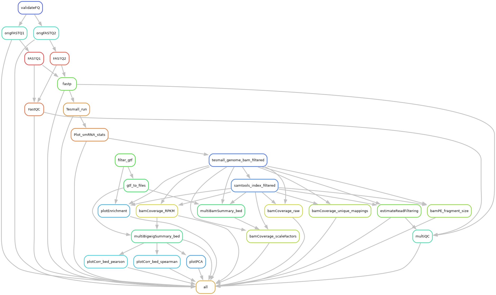

.. _smRNAseq:

smRNAseq
=================

What it does
------------

The snakePipes smRNAseq workflow processes single or paired-end small-RNA-seq fastq files: adapter
trimming and read merging with `fastp <https://github.com/OpenGene/fastp>`__, followed by
classification and quantification of miRNAs, piRNAs, other structural RNAs and transposable
elements with `TEsmall <https://github.com/mhammell-laboratory/TEsmall>`__. Additionally it performs deepTools-based
QC on the aligned reads and a MultiQC summary report.

Input requirements
-------------------

The only requirement is a directory of gzipped fastq files. Files could be single or paired end, and
the read extensions could be modified using the keys in the ``defaults.yaml`` file below.

The genome used must have been prepared with :ref:`createIndices` using the ``--tesmall`` flag, which
builds the RepeatMasker/miRBase/piRNAdb-derived annotation and bowtie indices TEsmall needs, and
records their location (``tesmall_db``/``tesmall_genome``) in the resulting organism YAML::

    createIndices -o /path/to/output --genome <genomeURL> --gtf <gtfURL> --tesmall --tesmallGenome mm10 mm10

``--tesmallGenome`` selects the UCSC/Ensembl build (e.g. ``mm10``, ``hg38``, ``mm39``, ``dm6``) used to
fetch TEsmall's reference data, and defaults to the ``GENOME`` positional argument if that is itself a
recognized build.

.. _smRNAconfig:

Configuration file
~~~~~~~~~~~~~~~~~~

There is a configuration file in ``snakePipes/workflows/smRNAseq/defaults.yaml``::

    ## General/Snakemake parameters, only used/set by wrapper or in Snakemake cmdl, but not in Snakefile
    pipeline: smrnaseq
    outdir:
    configFile:
    clusterConfigFile:
    local: False
    maxJobs: 5
    ## directory with fastq files
    indir:
    ## preconfigured target genomes (mm9,mm10,dm3,...) , see /path/to/snakemake_workflows/shared/organisms/
    ## Value can be also path to your own genome config file!
    genome:
    ## FASTQ file extension (default: ".fastq.gz")
    ext: '.fastq.gz'
    ## paired-end read name extension (default: ["_R1", "_R2"])
    reads: ["_R1","_R2"]
    ## assume paired end reads
    pairedEnd: True
    ## Number of reads to downsample from each FASTQ file
    downsample:
    ## Options for trimming
    trim: True
    trimmer: fastp
    ## further options
    mode: deepTools_qc
    sampleSheet:
    formula: ""
    bwBinSize: 25
    fastqc: True
    filterGTF:
    libraryType: 2
    verbose: False
    plotFormat: png
    #### Flag to control the pipeline entry point
    fromBAM: False
    bamExt: '.bam'
    ## DEG
    fdr: 0.05
    ## TEsmall read-length filtering (-m/-M)
    tesmallMinLen: 16
    tesmallMaxLen: 36
    ## Any other TEsmall option string, e.g. '--maxaln 200 --mismatch 1'
    tesmallOptions:

Apart from the common workflow options (see :ref:`running_snakePipes`), the following parameters are useful to consider:

* **tesmallMinLen** / **tesmallMaxLen**: passed to TEsmall as ``-m``/``-M`` -- reads shorter than
  ``tesmallMinLen`` or longer than ``tesmallMaxLen`` (after trimming) are discarded.

* **tesmallOptions**: any other TEsmall option string, appended as-is to the TEsmall call (see
  ``TEsmall --help`` for the full list of options not already covered by their own flag here).

* **plotFormat**: You can switch the type of plot produced by the deepTools modules using this option. Possible choices: png, pdf, svg, eps, plotly

Analysis modes
--------------

"deepTools_qc"
~~~~~~~~~~~~~~

The pipeline provides additional quality controls through deepTools, triggered via the
**deepTools_qc** mode (the default). TEsmall's genome-aligned reads for each sample are sorted into
``filtered_bam/{sample}.filtered.bam`` and fed to deepTools' ``bamCoverage``, ``plotEnrichment``,
``plotCorrelation``, ``plotPCA`` and related tools, and to MultiQC.

Understanding the outputs
--------------------------

Assuming the pipeline was run on a set of paired-end FASTQ files, the structure of the output
directory would look like this (files are shown only for one sample) ::

    ├── originalFASTQ
    ├── FastQC
    │   ├── sample1_R1_fastqc.html
    │   └── sample1_R2_fastqc.html
    ├── FASTQ_fastp
    │   ├── sample1.fastq.gz
    │   ├── sample1fastp.json
    │   └── sample1fastp.html
    ├── TEsmallOut
    │   ├── count_summary.txt
    │   ├── count_summary_plot.pdf
    │   ├── TEsmall.done
    │   ├── bam
    │   │   └── sample1.genome.bam
    │   ├── anno
    │   ├── log
    │   ├── rinfo
    │   ├── bedgraph
    │   ├── cca_fa
    │   └── fastq
    ├── filtered_bam
    │   ├── sample1.filtered.bam
    │   └── sample1.filtered.bam.bai
    ├── bamCoverage
    │   ├── sample1.coverage.bw
    │   ├── sample1.RPKM.bw
    │   ├── sample1.scaleFactors.bw
    │   ├── sample1.uniqueMappings.fwd.bw
    │   └── sample1.uniqueMappings.rev.bw
    ├── deepTools_qc
    │   ├── bamPEFragmentSize
    │   ├── estimateReadFiltering
    │   ├── multiBamSummary
    │   ├── multiBigwigSummary
    │   ├── plotCorrelation
    │   ├── plotEnrichment
    │   └── plotPCA
    ├── Annotation
    │   ├── genes.filtered.gtf
    │   ├── genes.filtered.bed
    │   ├── genes.filtered.t2g
    │   └── genes.filtered.symbol
    └── multiQC
        └── multiqc_report.html

Apart from the common module outputs (see :ref:`running_snakePipes`), the workflow would produce the following folders:

* **FASTQ_fastp**: Adapter-trimmed reads produced by `fastp <https://github.com/OpenGene/fastp>`__. For
  paired-end input, mate pairs are merged into a single ``{sample}.fastq.gz`` per sample.

* **TEsmallOut**: Output of `TEsmall <https://github.com/mhammell-laboratory/TEsmall>`__, reorganized by
  file type into subfolders (``bam``, ``anno``, ``log``, ``rinfo``, ``bedgraph``, ``cca_fa``,
  ``fastq``) for readability. **count_summary.txt** and **count_summary_plot.pdf** summarize how
  reads distribute across miRNA, piRNA, structural RNA, transposable-element and other categories.

* **filtered_bam**: The TEsmall genome-aligned BAM for each sample, sorted and indexed, used as
  input for deepTools and for viewing in IGV.

* **bamCoverage**: This would contain the bigWigs produced by deepTools `bamCoverage <https://deeptools.readthedocs.io/en/develop/content/tools/bamCoverage.html>`__. Files with suffix ``.coverage.bw`` are raw coverage files, while the files with suffix ``RPKM.bw`` are `RPKM-normalized <https://www.biostars.org/p/273537/>`__ coverage files.

* **deepTools_qc**: (produced in the **deepTools_qc** mode) Quality checks performed via deepTools, named after the corresponding deepTools function -- see `deepTools documentation <deeptools.readthedocs.io>`__. In short: insert size distribution (**bamPEFragmentSize**), mapping statistics (**estimateReadFiltering**), sample-to-sample correlations and PCA (**multiBamSummary, multiBigwigSummary, plotCorrelation, plotPCA**), and read enrichment on genic features (**plotEnrichment**).

* **multiQC**: This folder contains the report produced by MultiQC, summarizing fastp, FastQC and deepTools outputs.

Command line options
--------------------

.. argparse::
    :func: parse_args
    :filename: ../snakePipes/workflows/smRNAseq/smRNAseq.py
    :prog: smRNAseq
    :nodefault:
